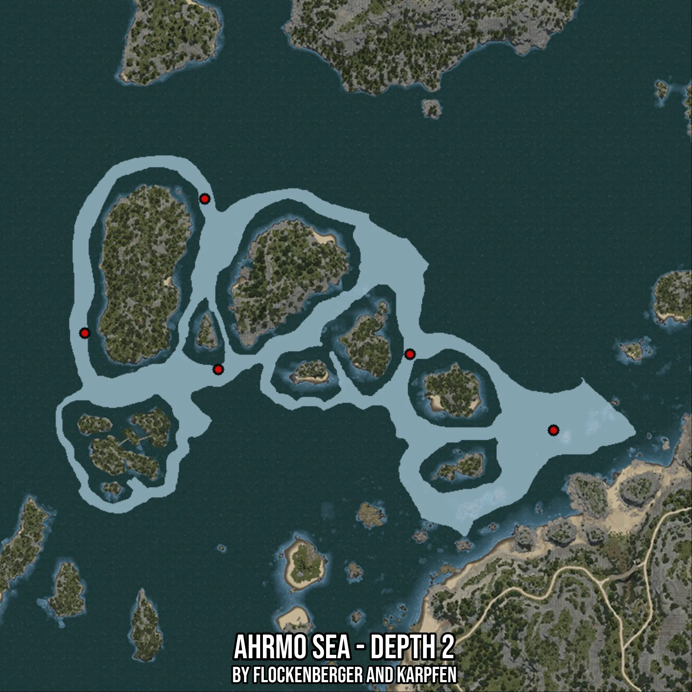

# Ahrmo Sea - Depth 2
Created by **flockenberger**

- **Red Points**: Exact in-game waypoints.
- **Colored Areas**: Entire area where the fishing table is consistent.
## ⚠️ Info about your float:
To verify your fishing position without modifying your files, you can do so [here](https://flockenberger.github.io/bdo-fish-position/).
- Or watch the guide [here](https://youtu.be/t-VXcRoNojk)

## Waypoints
Below you'll find the Copy-Paste ready XML file for this Fishing-Zone.

```xml
	<!--
		Waypoints for: Ahrmo Sea - Depth 2
		Auto-Generated by: flockenberger
		Preview at: https://github.com/Flockenberger/bdo-fish-waypoints/tree/main/Bookmark/Ahrmo%20Sea%20-%20Depth%202
	-->
	<WorldmapBookMark>
		<BookMark BookMarkName="1: Ahrmo Sea - Depth 2" PosX="-460498.7924814224" PosY="-8175.0" PosZ="193054.08136844635" />
		<BookMark BookMarkName="2: Ahrmo Sea - Depth 2" PosX="-417731.73282146454" PosY="-8175.0" PosZ="240941.14112854004" />
		<BookMark BookMarkName="3: Ahrmo Sea - Depth 2" PosX="-293345.8480358124" PosY="-8175.0" PosZ="158418.78657341003" />
		<BookMark BookMarkName="4: Ahrmo Sea - Depth 2" PosX="-344545.8490371704" PosY="-8175.0" PosZ="185524.66945648193" />
		<BookMark BookMarkName="5: Ahrmo Sea - Depth 2" PosX="-412912.9091978073" PosY="-8175.0" PosZ="180103.49287986755" />
	</WorldmapBookMark>
```

## Usage Guide
[](https://youtu.be/W-bWmKdv8K8)

## Previews
     

 