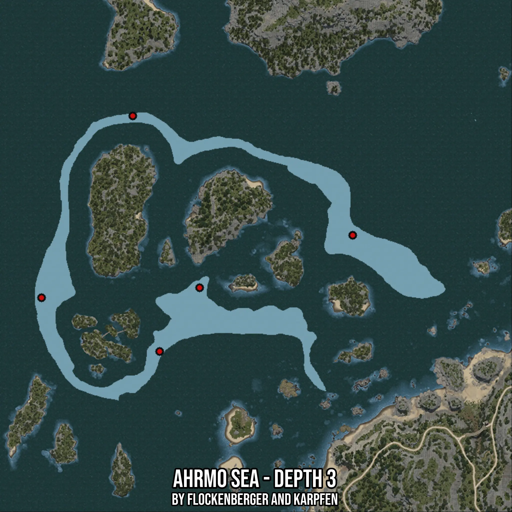

# Ahrmo Sea - Depth 3
Created by **flockenberger**

- **Red Points**: Exact in-game waypoints.
- **Colored Areas**: Entire area where the fishing table is consistent.
## ⚠️ Info about your float:
To verify your fishing position without modifying your files, you can do so [here](https://flockenberger.github.io/bdo-fish-position/).
- Or watch the guide [here](https://youtu.be/t-VXcRoNojk)

## Waypoints
Below you'll find the Copy-Paste ready XML file for this Fishing-Zone.

```xml
	<!--
		Waypoints for: Ahrmo Sea - Depth 3
		Auto-Generated by: flockenberger
		Preview at: https://github.com/Flockenberger/bdo-fish-waypoints/tree/main/Bookmark/Ahrmo%20Sea%20-%20Depth%203
	-->
	<WorldmapBookMark>
		<BookMark BookMarkName="1: Ahrmo Sea - Depth 3" PosX="-433694.0860748291" PosY="-8175.0" PosZ="259614.0826702118" />
		<BookMark BookMarkName="2: Ahrmo Sea - Depth 3" PosX="-420743.4975862503" PosY="-8175.0" PosZ="146070.5510377884" />
		<BookMark BookMarkName="3: Ahrmo Sea - Depth 3" PosX="-401468.2030916214" PosY="-8175.0" PosZ="176790.5516386032" />
		<BookMark BookMarkName="4: Ahrmo Sea - Depth 3" PosX="-327679.9663543701" PosY="-8175.0" PosZ="202089.37566280365" />
		<BookMark BookMarkName="5: Ahrmo Sea - Depth 3" PosX="-477665.8516407013" PosY="-8175.0" PosZ="171971.72801494598" />
	</WorldmapBookMark>
```

## Usage Guide
[](https://youtu.be/W-bWmKdv8K8)

## Previews
     

 