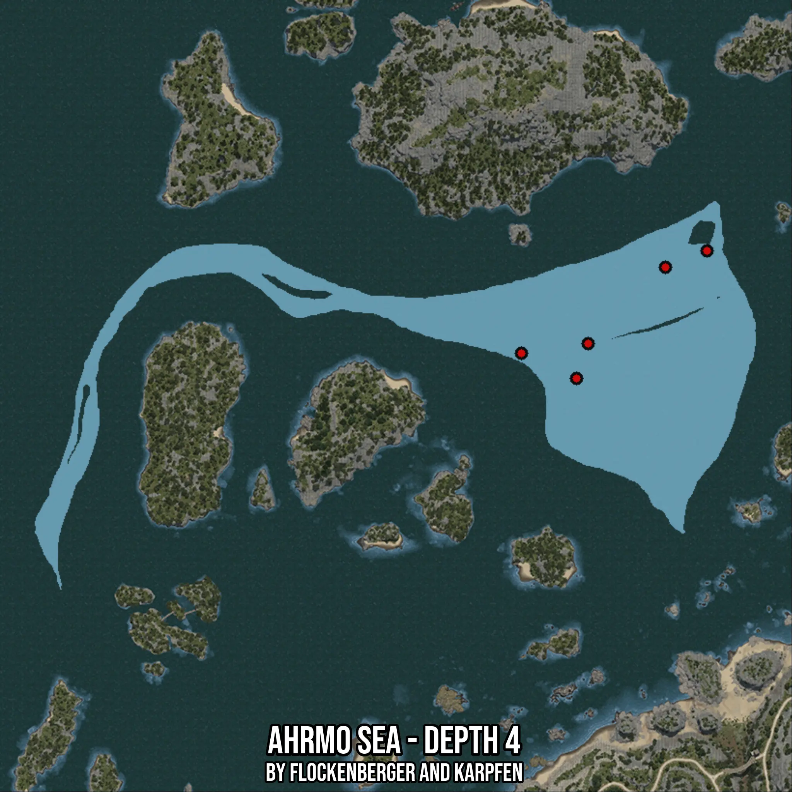

# Ahrmo Sea - Depth 4
Created by **flockenberger**

- **Red Points**: Exact in-game waypoints.
- **Colored Areas**: Entire area where the fishing table is consistent.
## ⚠️ Info about your float:
To verify your fishing position without modifying your files, you can do so [here](https://flockenberger.github.io/bdo-fish-position/).
- Or watch the guide [here](https://youtu.be/t-VXcRoNojk)

## Waypoints
Below you'll find the Copy-Paste ready XML file for this Fishing-Zone.

```xml
	<!--
		Waypoints for: Ahrmo Sea - Depth 4
		Auto-Generated by: flockenberger
		Preview at: https://github.com/Flockenberger/bdo-fish-waypoints/tree/main/Bookmark/Ahrmo%20Sea%20-%20Depth%204
	-->
	<WorldmapBookMark>
		<BookMark BookMarkName="1: Ahrmo Sea - Depth 4" PosX="-315632.90729522705" PosY="-8175.0" PosZ="239134.08226966858" />
		<BookMark BookMarkName="2: Ahrmo Sea - Depth 4" PosX="-291538.7891769409" PosY="-8175.0" PosZ="262927.02391147614" />
		<BookMark BookMarkName="3: Ahrmo Sea - Depth 4" PosX="-336414.08417224884" PosY="-8175.0" PosZ="236122.3175048828" />
		<BookMark BookMarkName="4: Ahrmo Sea - Depth 4" PosX="-319247.02501296997" PosY="-8175.0" PosZ="228291.72911643982" />
		<BookMark BookMarkName="5: Ahrmo Sea - Depth 4" PosX="-278588.2006883621" PosY="-8175.0" PosZ="268047.02401161194" />
	</WorldmapBookMark>
```

## Usage Guide
[](https://youtu.be/W-bWmKdv8K8)

## Previews
     

 