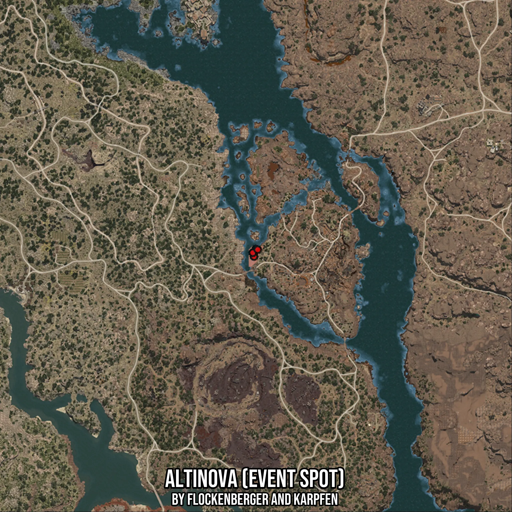

# Altinova (Event Spot)
Created by **flockenberger**

- **Red Points**: Exact in-game waypoints.
- **Colored Areas**: Entire area where the fishing table is consistent.
## ⚠️ Info about your float:
To verify your fishing position without modifying your files, you can do so [here](https://flockenberger.github.io/bdo-fish-position/).
- Or watch the guide [here](https://youtu.be/t-VXcRoNojk)

## Waypoints
Below you'll find the Copy-Paste ready XML file for this Fishing-Zone.

```xml
	<!--
		Waypoints for: Altinova (Event Spot)
		Auto-Generated by: flockenberger
		Preview at: https://github.com/Flockenberger/bdo-fish-waypoints/tree/main/Bookmark/Altinova%20(Event%20Spot)
	-->
	<WorldmapBookMark>
		<BookMark BookMarkName="1: Altinova (Event Spot)" PosX="337618.8701868057" PosY="-8175.0" PosZ="-59331.80592060089" />
		<BookMark BookMarkName="2: Altinova (Event Spot)" PosX="336715.34075737" PosY="-8175.0" PosZ="-61138.86477947235" />
		<BookMark BookMarkName="3: Altinova (Event Spot)" PosX="336715.34075737" PosY="-8175.0" PosZ="-62945.92363834381" />
		<BookMark BookMarkName="4: Altinova (Event Spot)" PosX="336112.98780441284" PosY="-8175.0" PosZ="-61138.86477947235" />
		<BookMark BookMarkName="5: Altinova (Event Spot)" PosX="338522.39961624146" PosY="-8175.0" PosZ="-59632.98239707947" />
	</WorldmapBookMark>
```

## Usage Guide
[](https://youtu.be/W-bWmKdv8K8)

## Previews
     

 