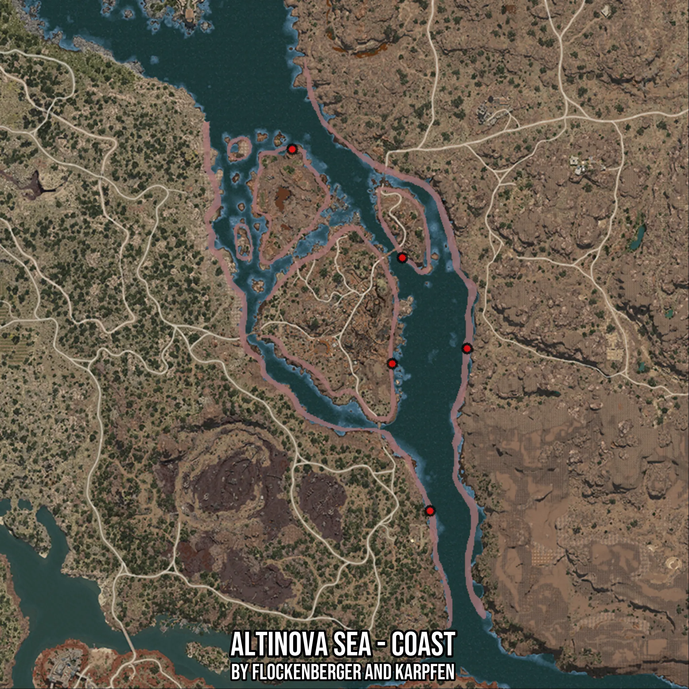

# Altinova Sea - Coast
Created by **flockenberger**

- **Red Points**: Exact in-game waypoints.
- **Colored Areas**: Entire area where the fishing table is consistent.
## ⚠️ Info about your float:
To verify your fishing position without modifying your files, you can do so [here](https://flockenberger.github.io/bdo-fish-position/).
- Or watch the guide [here](https://youtu.be/t-VXcRoNojk)

## Waypoints
Below you'll find the Copy-Paste ready XML file for this Fishing-Zone.

```xml
	<!--
		Waypoints for: Altinova Sea - Coast
		Auto-Generated by: flockenberger
		Preview at: https://github.com/Flockenberger/bdo-fish-waypoints/tree/main/Bookmark/Altinova%20Sea%20-%20Coast
	-->
	<WorldmapBookMark>
		<BookMark BookMarkName="1: Altinova Sea - Coast" PosX="412009.45987701416" PosY="-8175.0" PosZ="-75294.15917396545" />
		<BookMark BookMarkName="2: Altinova Sea - Coast" PosX="398757.6949119568" PosY="-8175.0" PosZ="-133421.21913433075" />
		<BookMark BookMarkName="3: Altinova Sea - Coast" PosX="385204.75347042084" PosY="-8175.0" PosZ="-80715.33575057983" />
		<BookMark BookMarkName="4: Altinova Sea - Coast" PosX="349364.7527694702" PosY="-8175.0" PosZ="-3915.3342485427856" />
		<BookMark BookMarkName="5: Altinova Sea - Coast" PosX="388818.87118816376" PosY="-8175.0" PosZ="-42767.099714279175" />
	</WorldmapBookMark>
```

## Usage Guide
[](https://youtu.be/W-bWmKdv8K8)

## Previews
     

 