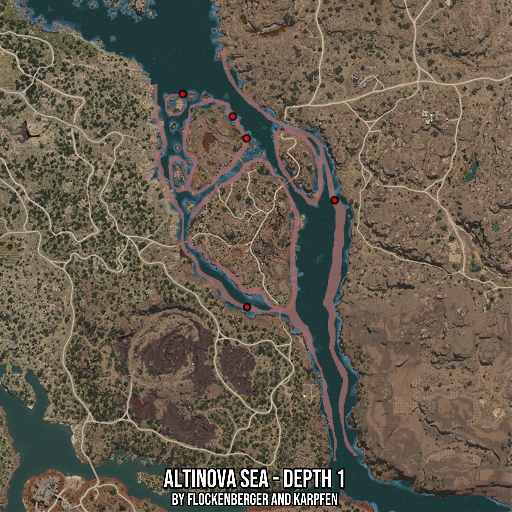

# Altinova Sea - Depth 1
Created by **flockenberger**

- **Red Points**: Exact in-game waypoints.
- **Colored Areas**: Entire area where the fishing table is consistent.
## ⚠️ Info about your float:
To verify your fishing position without modifying your files, you can do so [here](https://flockenberger.github.io/bdo-fish-position/).
- Or watch the guide [here](https://youtu.be/t-VXcRoNojk)

## Waypoints
Below you'll find the Copy-Paste ready XML file for this Fishing-Zone.

```xml
	<!--
		Waypoints for: Altinova Sea - Depth 1
		Auto-Generated by: flockenberger
		Preview at: https://github.com/Flockenberger/bdo-fish-waypoints/tree/main/Bookmark/Altinova%20Sea%20-%20Depth%201
	-->
	<WorldmapBookMark>
		<BookMark BookMarkName="1: Altinova Sea - Depth 1" PosX="364724.7530698776" PosY="-8175.0" PosZ="-101195.33615112305" />
		<BookMark BookMarkName="2: Altinova Sea - Depth 1" PosX="406889.45977687836" PosY="-8175.0" PosZ="-49694.15867328644" />
		<BookMark BookMarkName="3: Altinova Sea - Depth 1" PosX="357797.69411087036" PosY="-8175.0" PosZ="-9336.510825157166" />
		<BookMark BookMarkName="4: Altinova Sea - Depth 1" PosX="333703.5759925842" PosY="-8175.0" PosZ="1505.8423280715942" />
		<BookMark BookMarkName="5: Altinova Sea - Depth 1" PosX="364423.57659339905" PosY="-8175.0" PosZ="-19877.68750190735" />
	</WorldmapBookMark>
```

## Usage Guide
[](https://youtu.be/W-bWmKdv8K8)

## Previews
     

 