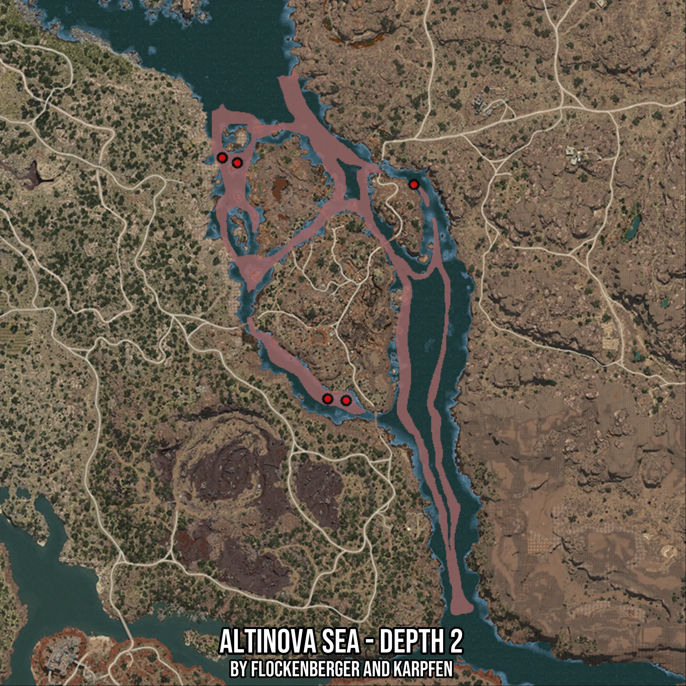

# Altinova Sea - Depth 2
Created by **flockenberger**

- **Red Points**: Exact in-game waypoints.
- **Colored Areas**: Entire area where the fishing table is consistent.
## ⚠️ Info about your float:
To verify your fishing position without modifying your files, you can do so [here](https://flockenberger.github.io/bdo-fish-position/).
- Or watch the guide [here](https://youtu.be/t-VXcRoNojk)

## Waypoints
Below you'll find the Copy-Paste ready XML file for this Fishing-Zone.

```xml
	<!--
		Waypoints for: Altinova Sea - Depth 2
		Auto-Generated by: flockenberger
		Preview at: https://github.com/Flockenberger/bdo-fish-waypoints/tree/main/Bookmark/Altinova%20Sea%20-%20Depth%202
	-->
	<WorldmapBookMark>
		<BookMark BookMarkName="1: Altinova Sea - Depth 2" PosX="330691.81122779846" PosY="-8175.0" PosZ="-12348.275589942932" />
		<BookMark BookMarkName="2: Altinova Sea - Depth 2" PosX="369844.7531700134" PosY="-8175.0" PosZ="-97882.3949098587" />
		<BookMark BookMarkName="3: Altinova Sea - Depth 2" PosX="394240.04776477814" PosY="-8175.0" PosZ="-20178.863978385925" />
		<BookMark BookMarkName="4: Altinova Sea - Depth 2" PosX="363218.87068748474" PosY="-8175.0" PosZ="-97280.04195690155" />
		<BookMark BookMarkName="5: Altinova Sea - Depth 2" PosX="325270.6346511841" PosY="-8175.0" PosZ="-10541.216731071472" />
	</WorldmapBookMark>
```

## Usage Guide
[](https://youtu.be/W-bWmKdv8K8)

## Previews
     

 