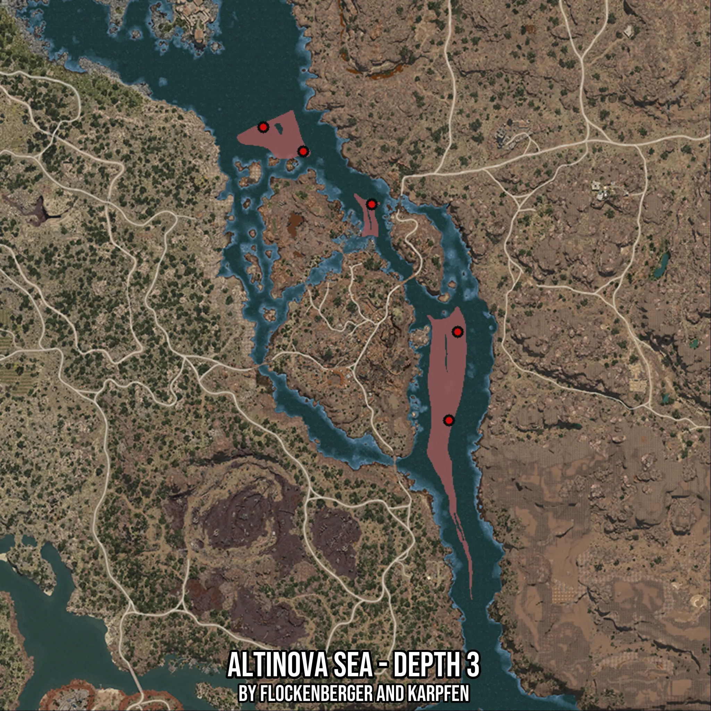

# Altinova Sea - Depth 3
Created by **flockenberger**

- **Red Points**: Exact in-game waypoints.
- **Colored Areas**: Entire area where the fishing table is consistent.
## ⚠️ Info about your float:
To verify your fishing position without modifying your files, you can do so [here](https://flockenberger.github.io/bdo-fish-position/).
- Or watch the guide [here](https://youtu.be/t-VXcRoNojk)

## Waypoints
Below you'll find the Copy-Paste ready XML file for this Fishing-Zone.

```xml
	<!--
		Waypoints for: Altinova Sea - Depth 3
		Auto-Generated by: flockenberger
		Preview at: https://github.com/Flockenberger/bdo-fish-waypoints/tree/main/Bookmark/Altinova%20Sea%20-%20Depth%203
	-->
	<WorldmapBookMark>
		<BookMark BookMarkName="1: Altinova Sea - Depth 3" PosX="399360.04786491394" PosY="-8175.0" PosZ="-89449.45356845856" />
		<BookMark BookMarkName="2: Altinova Sea - Depth 3" PosX="334908.28189849854" PosY="-8175.0" PosZ="12348.195481300354" />
		<BookMark BookMarkName="3: Altinova Sea - Depth 3" PosX="372555.3414583206" PosY="-8175.0" PosZ="-14456.510925292969" />
		<BookMark BookMarkName="4: Altinova Sea - Depth 3" PosX="402371.8126296997" PosY="-8175.0" PosZ="-58729.45296764374" />
		<BookMark BookMarkName="5: Altinova Sea - Depth 3" PosX="348762.39981651306" PosY="-8175.0" PosZ="3915.2541399002075" />
	</WorldmapBookMark>
```

## Usage Guide
[](https://youtu.be/W-bWmKdv8K8)

## Previews
     

 