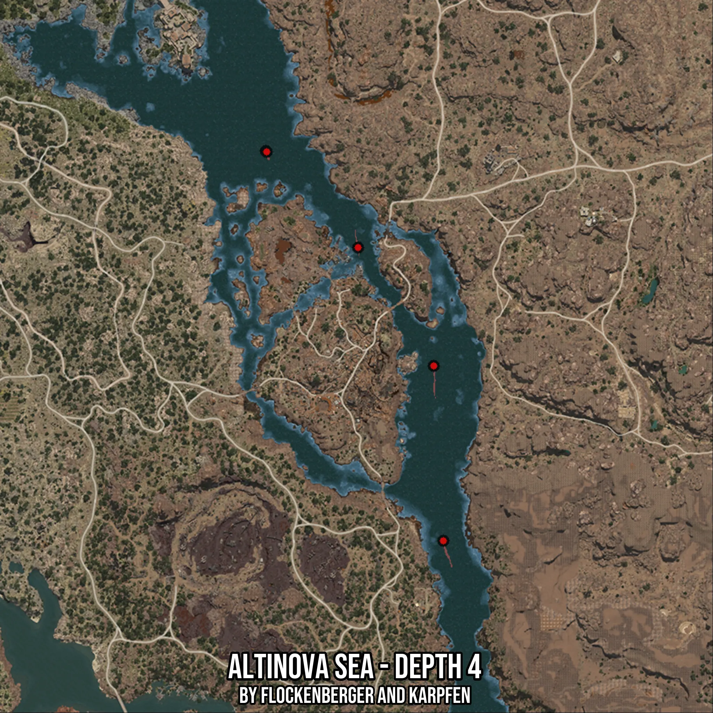

# Altinova Sea - Depth 4
Created by **flockenberger**

- **Red Points**: Exact in-game waypoints.
- **Colored Areas**: Entire area where the fishing table is consistent.
## ⚠️ Info about your float:
To verify your fishing position without modifying your files, you can do so [here](https://flockenberger.github.io/bdo-fish-position/).
- Or watch the guide [here](https://youtu.be/t-VXcRoNojk)

## Waypoints
Below you'll find the Copy-Paste ready XML file for this Fishing-Zone.

```xml
	<!--
		Waypoints for: Altinova Sea - Depth 4
		Auto-Generated by: flockenberger
		Preview at: https://github.com/Flockenberger/bdo-fish-waypoints/tree/main/Bookmark/Altinova%20Sea%20-%20Depth%204
	-->
	<WorldmapBookMark>
		<BookMark BookMarkName="1: Altinova Sea - Depth 4" PosX="340028.28199863434" PosY="-8175.0" PosZ="12950.548434257507" />
		<BookMark BookMarkName="2: Altinova Sea - Depth 4" PosX="398155.34195899963" PosY="-8175.0" PosZ="-61440.04125595093" />
		<BookMark BookMarkName="3: Altinova Sea - Depth 4" PosX="401468.283200264" PosY="-8175.0" PosZ="-121976.51302814484" />
		<BookMark BookMarkName="4: Altinova Sea - Depth 4" PosX="371952.98850536346" PosY="-8175.0" PosZ="-20480.040454864502" />
		<BookMark BookMarkName="5: Altinova Sea - Depth 4" PosX="340329.4584751129" PosY="-8175.0" PosZ="12649.37195777893" />
	</WorldmapBookMark>
```

## Usage Guide
[](https://youtu.be/W-bWmKdv8K8)

## Previews
     

 