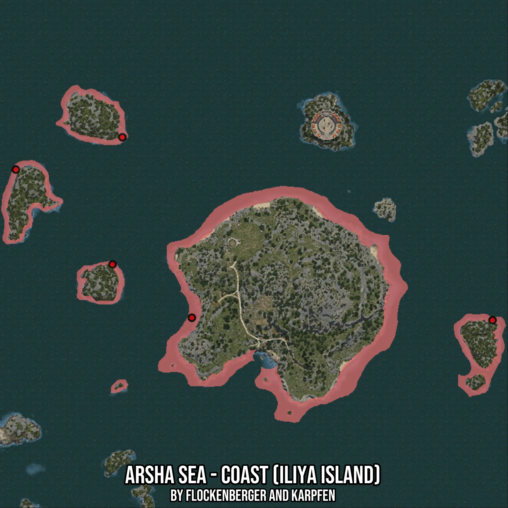

# Arsha Sea - Coast (Iliya Island)
Created by **flockenberger**

- **Red Points**: Exact in-game waypoints.
- **Colored Areas**: Entire area where the fishing table is consistent.
## ⚠️ Info about your float:
To verify your fishing position without modifying your files, you can do so [here](https://flockenberger.github.io/bdo-fish-position/).
- Or watch the guide [here](https://youtu.be/t-VXcRoNojk)

## Waypoints
Below you'll find the Copy-Paste ready XML file for this Fishing-Zone.

```xml
	<!--
		Waypoints for: Arsha Sea - Coast (Iliya Island)
		Auto-Generated by: flockenberger
		Preview at: https://github.com/Flockenberger/bdo-fish-waypoints/tree/main/Bookmark/Arsha%20Sea%20-%20Coast%20(Iliya%20Island)
	-->
	<WorldmapBookMark>
		<BookMark BookMarkName="1: Arsha Sea - Coast (Iliya Island)" PosX="118362.39531040192" PosY="-8175.0" PosZ="310211.7307186127" />
		<BookMark BookMarkName="2: Arsha Sea - Coast (Iliya Island)" PosX="264432.9864025116" PosY="-8175.0" PosZ="309007.02481269836" />
		<BookMark BookMarkName="3: Arsha Sea - Coast (Iliya Island)" PosX="32828.275990486145" PosY="-8175.0" PosZ="382192.9085969925" />
		<BookMark BookMarkName="4: Arsha Sea - Coast (Iliya Island)" PosX="84630.62994480133" PosY="-8175.0" PosZ="397854.0853738785" />
		<BookMark BookMarkName="5: Arsha Sea - Coast (Iliya Island)" PosX="79811.8063211441" PosY="-8175.0" PosZ="336112.90769577026" />
	</WorldmapBookMark>
```

## Usage Guide
[](https://youtu.be/W-bWmKdv8K8)

## Previews
     

 