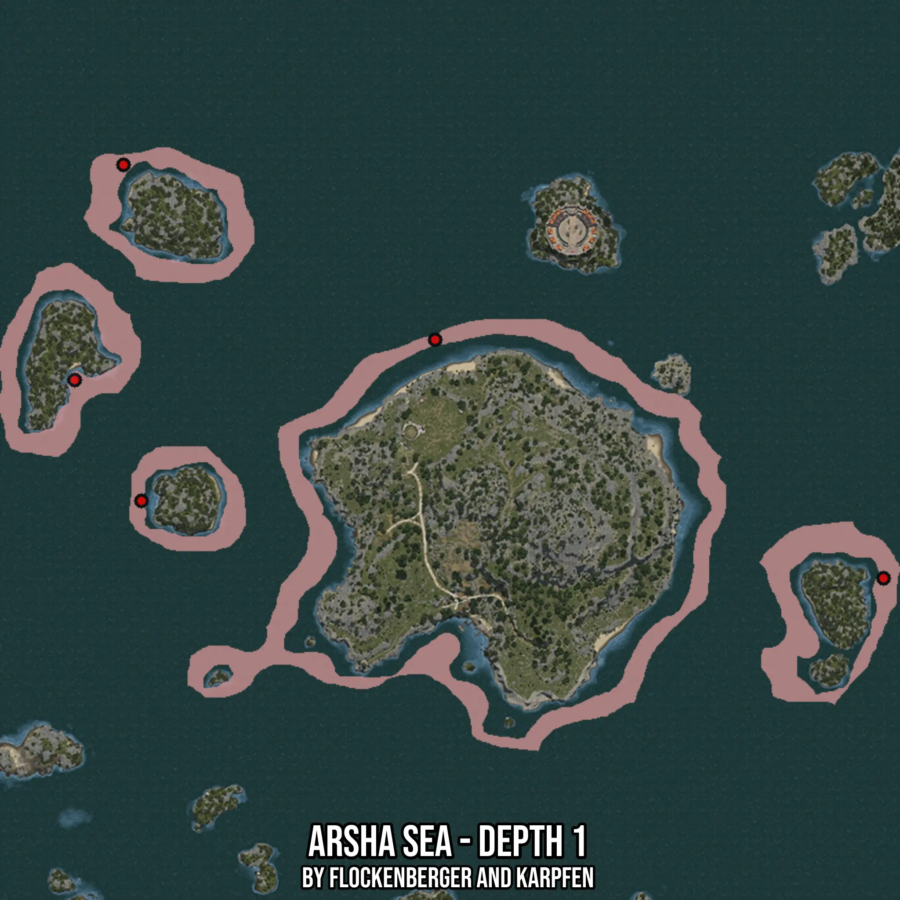

# Arsha Sea - Depth 1
Created by **flockenberger**

- **Red Points**: Exact in-game waypoints.
- **Colored Areas**: Entire area where the fishing table is consistent.
## ⚠️ Info about your float:
To verify your fishing position without modifying your files, you can do so [here](https://flockenberger.github.io/bdo-fish-position/).
- Or watch the guide [here](https://youtu.be/t-VXcRoNojk)

## Waypoints
Below you'll find the Copy-Paste ready XML file for this Fishing-Zone.

```xml
	<!--
		Waypoints for: Arsha Sea - Depth 1
		Auto-Generated by: flockenberger
		Preview at: https://github.com/Flockenberger/bdo-fish-waypoints/tree/main/Bookmark/Arsha%20Sea%20-%20Depth%201
	-->
	<WorldmapBookMark>
		<BookMark BookMarkName="1: Arsha Sea - Depth 1" PosX="144865.92524051666" PosY="-8175.0" PosZ="372555.26134967804" />
		<BookMark BookMarkName="2: Arsha Sea - Depth 1" PosX="272263.5747909546" PosY="-8175.0" PosZ="304790.5541419983" />
		<BookMark BookMarkName="3: Arsha Sea - Depth 1" PosX="42465.9232378006" PosY="-8175.0" PosZ="361110.5552434921" />
		<BookMark BookMarkName="4: Arsha Sea - Depth 1" PosX="56320.041155815125" PosY="-8175.0" PosZ="422249.3799686432" />
		<BookMark BookMarkName="5: Arsha Sea - Depth 1" PosX="61440.04125595093" PosY="-8175.0" PosZ="326776.4369249344" />
	</WorldmapBookMark>
```

## Usage Guide
[](https://youtu.be/W-bWmKdv8K8)

## Previews
     

 