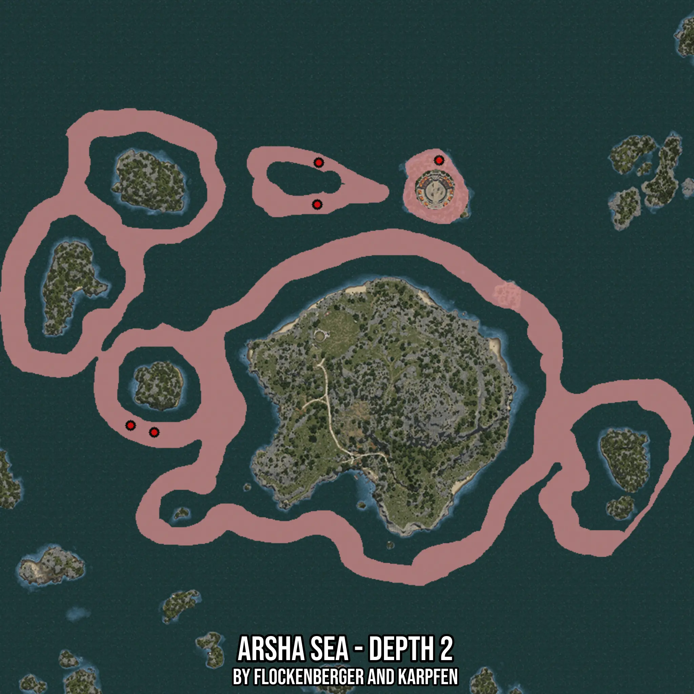

# Arsha Sea - Depth 2
Created by **flockenberger**

- **Red Points**: Exact in-game waypoints.
- **Colored Areas**: Entire area where the fishing table is consistent.
## ⚠️ Info about your float:
To verify your fishing position without modifying your files, you can do so [here](https://flockenberger.github.io/bdo-fish-position/).
- Or watch the guide [here](https://youtu.be/t-VXcRoNojk)

## Waypoints
Below you'll find the Copy-Paste ready XML file for this Fishing-Zone.

```xml
	<!--
		Waypoints for: Arsha Sea - Depth 2
		Auto-Generated by: flockenberger
		Preview at: https://github.com/Flockenberger/bdo-fish-waypoints/tree/main/Bookmark/Arsha%20Sea%20-%20Depth%202
	-->
	<WorldmapBookMark>
		<BookMark BookMarkName="1: Arsha Sea - Depth 2" PosX="72583.57088565826" PosY="-8175.0" PosZ="308404.6718597412" />
		<BookMark BookMarkName="2: Arsha Sea - Depth 2" PosX="137035.33685207367" PosY="-8175.0" PosZ="398456.43832683563" />
		<BookMark BookMarkName="3: Arsha Sea - Depth 2" PosX="185223.57308864594" PosY="-8175.0" PosZ="415924.6739625931" />
		<BookMark BookMarkName="4: Arsha Sea - Depth 2" PosX="137637.68980503082" PosY="-8175.0" PosZ="415021.14453315735" />
		<BookMark BookMarkName="5: Arsha Sea - Depth 2" PosX="63247.10011482239" PosY="-8175.0" PosZ="311115.2601480484" />
	</WorldmapBookMark>
```

## Usage Guide
[](https://youtu.be/W-bWmKdv8K8)

## Previews
     

 