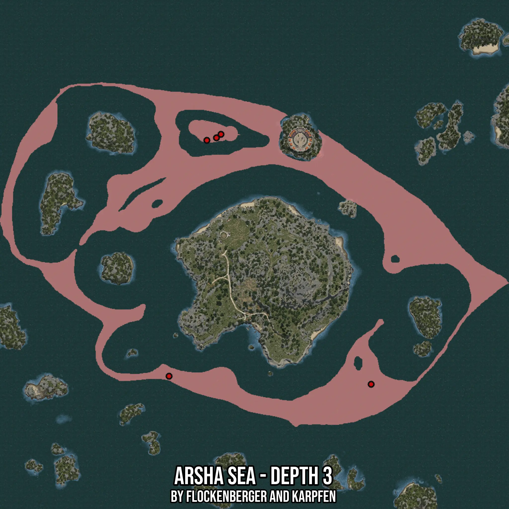

# Arsha Sea - Depth 3
Created by **flockenberger**

- **Red Points**: Exact in-game waypoints.
- **Colored Areas**: Entire area where the fishing table is consistent.
## ⚠️ Info about your float:
To verify your fishing position without modifying your files, you can do so [here](https://flockenberger.github.io/bdo-fish-position/).
- Or watch the guide [here](https://youtu.be/t-VXcRoNojk)

## Waypoints
Below you'll find the Copy-Paste ready XML file for this Fishing-Zone.

```xml
	<!--
		Waypoints for: Arsha Sea - Depth 3
		Auto-Generated by: flockenberger
		Preview at: https://github.com/Flockenberger/bdo-fish-waypoints/tree/main/Bookmark/Arsha%20Sea%20-%20Depth%203
	-->
	<WorldmapBookMark>
		<BookMark BookMarkName="1: Arsha Sea - Depth 3" PosX="226183.57388973236" PosY="-8175.0" PosZ="257505.84733486176" />
		<BookMark BookMarkName="2: Arsha Sea - Depth 3" PosX="133722.39561080933" PosY="-8175.0" PosZ="404781.14433288574" />
		<BookMark BookMarkName="3: Arsha Sea - Depth 3" PosX="128000.04255771637" PosY="-8175.0" PosZ="403275.26195049286" />
		<BookMark BookMarkName="4: Arsha Sea - Depth 3" PosX="136432.98389911652" PosY="-8175.0" PosZ="406889.3796682358" />
		<BookMark BookMarkName="5: Arsha Sea - Depth 3" PosX="105411.80682182312" PosY="-8175.0" PosZ="262324.670958519" />
	</WorldmapBookMark>
```

## Usage Guide
[](https://youtu.be/W-bWmKdv8K8)

## Previews
     

 