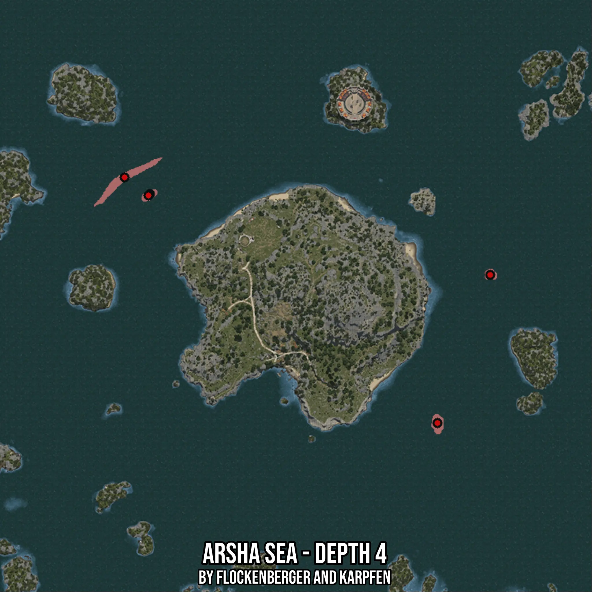

# Arsha Sea - Depth 4
Created by **flockenberger**

- **Red Points**: Exact in-game waypoints.
- **Colored Areas**: Entire area where the fishing table is consistent.
## ⚠️ Info about your float:
To verify your fishing position without modifying your files, you can do so [here](https://flockenberger.github.io/bdo-fish-position/).
- Or watch the guide [here](https://youtu.be/t-VXcRoNojk)

## Waypoints
Below you'll find the Copy-Paste ready XML file for this Fishing-Zone.

```xml
	<!--
		Waypoints for: Arsha Sea - Depth 4
		Auto-Generated by: flockenberger
		Preview at: https://github.com/Flockenberger/bdo-fish-waypoints/tree/main/Bookmark/Arsha%20Sea%20-%20Depth%204
	-->
	<WorldmapBookMark>
		<BookMark BookMarkName="1: Arsha Sea - Depth 4" PosX="87943.57118606567" PosY="-8175.0" PosZ="372856.4378261566" />
		<BookMark BookMarkName="2: Arsha Sea - Depth 4" PosX="218352.98550128937" PosY="-8175.0" PosZ="270456.43582344055" />
		<BookMark BookMarkName="3: Arsha Sea - Depth 4" PosX="98484.74786281586" PosY="-8175.0" PosZ="365929.37886714935" />
		<BookMark BookMarkName="4: Arsha Sea - Depth 4" PosX="240338.86828422546" PosY="-8175.0" PosZ="332197.61350154877" />
		<BookMark BookMarkName="5: Arsha Sea - Depth 4" PosX="97882.3949098587" PosY="-8175.0" PosZ="365327.0259141922" />
	</WorldmapBookMark>
```

## Usage Guide
[](https://youtu.be/W-bWmKdv8K8)

## Previews
     

 