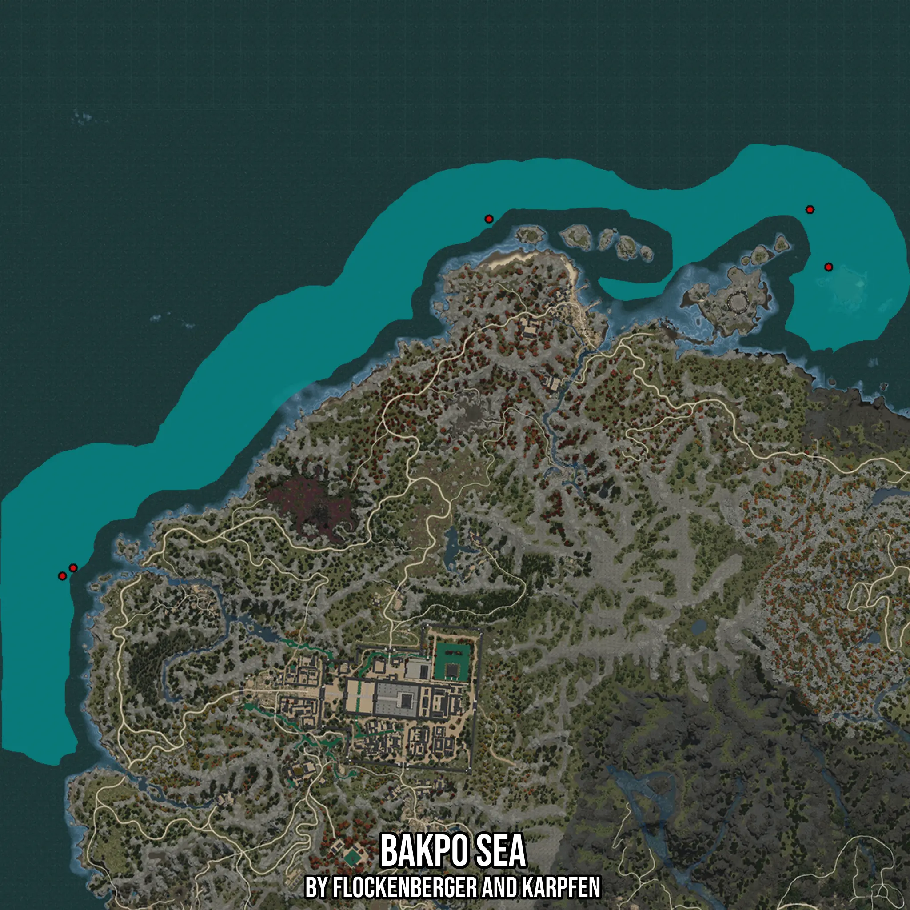

# Bakpo Sea
Created by **flockenberger**

- **Red Points**: Exact in-game waypoints.
- **Colored Areas**: Entire area where the fishing table is consistent.
## ⚠️ Info about your float:
To verify your fishing position without modifying your files, you can do so [here](https://flockenberger.github.io/bdo-fish-position/).
- Or watch the guide [here](https://youtu.be/t-VXcRoNojk)

## Waypoints
Below you'll find the Copy-Paste ready XML file for this Fishing-Zone.

```xml
	<!--
		Waypoints for: Bakpo Sea
		Auto-Generated by: flockenberger
		Preview at: https://github.com/Flockenberger/bdo-fish-waypoints/tree/main/Bookmark/Bakpo%20Sea
	-->
	<WorldmapBookMark>
		<BookMark BookMarkName="1: Bakpo Sea" PosX="-1236028.2194137573" PosY="-8175.0" PosZ="1554672.9315280914" />
		<BookMark BookMarkName="2: Bakpo Sea" PosX="-1227595.2780723572" PosY="-8175.0" PosZ="1528771.7545509338" />
		<BookMark BookMarkName="3: Bakpo Sea" PosX="-1380592.9281234741" PosY="-8175.0" PosZ="1550456.4608573914" />
		<BookMark BookMarkName="4: Bakpo Sea" PosX="-1567924.6964931488" PosY="-8175.0" PosZ="1393242.3401355743" />
		<BookMark BookMarkName="5: Bakpo Sea" PosX="-1572743.520116806" PosY="-8175.0" PosZ="1389628.2224178314" />
	</WorldmapBookMark>
```

## Usage Guide
[](https://youtu.be/W-bWmKdv8K8)

## Previews
     

 