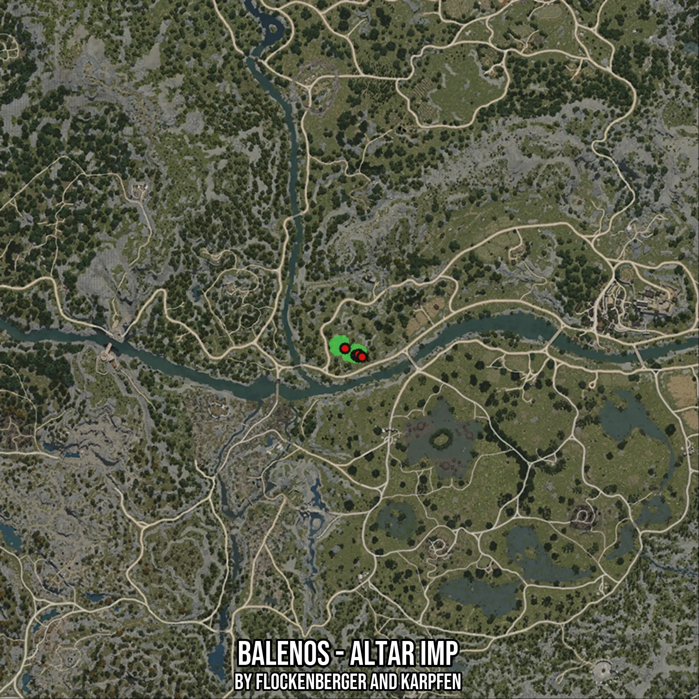

# Balenos - Altar Imp
Created by **flockenberger**

- **Red Points**: Exact in-game waypoints.
- **Colored Areas**: Entire area where the fishing table is consistent.
## ⚠️ Info about your float:
To verify your fishing position without modifying your files, you can do so [here](https://flockenberger.github.io/bdo-fish-position/).
- Or watch the guide [here](https://youtu.be/t-VXcRoNojk)

## Waypoints
Below you'll find the Copy-Paste ready XML file for this Fishing-Zone.

```xml
	<!--
		Waypoints for: Balenos - Altar Imp
		Auto-Generated by: flockenberger
		Preview at: https://github.com/Flockenberger/bdo-fish-waypoints/tree/main/Bookmark/Balenos%20-%20Altar%20Imp
	-->
	<WorldmapBookMark>
		<BookMark BookMarkName="1: Balenos - Altar Imp" PosX="-46381.13732337952" PosY="0.0" PosZ="-53609.452867507935" />
		<BookMark BookMarkName="2: Balenos - Altar Imp" PosX="-47284.66675281525" PosY="0.0" PosZ="-53007.09991455078" />
		<BookMark BookMarkName="3: Balenos - Altar Imp" PosX="-46381.13732337952" PosY="0.0" PosZ="-52705.923438072205" />
		<BookMark BookMarkName="4: Balenos - Altar Imp" PosX="-45176.43141746521" PosY="0.0" PosZ="-53609.452867507935" />
		<BookMark BookMarkName="5: Balenos - Altar Imp" PosX="-51199.96094703674" PosY="0.0" PosZ="-50597.68810272217" />
	</WorldmapBookMark>
```

## Usage Guide
[](https://youtu.be/W-bWmKdv8K8)

## Previews
     

 