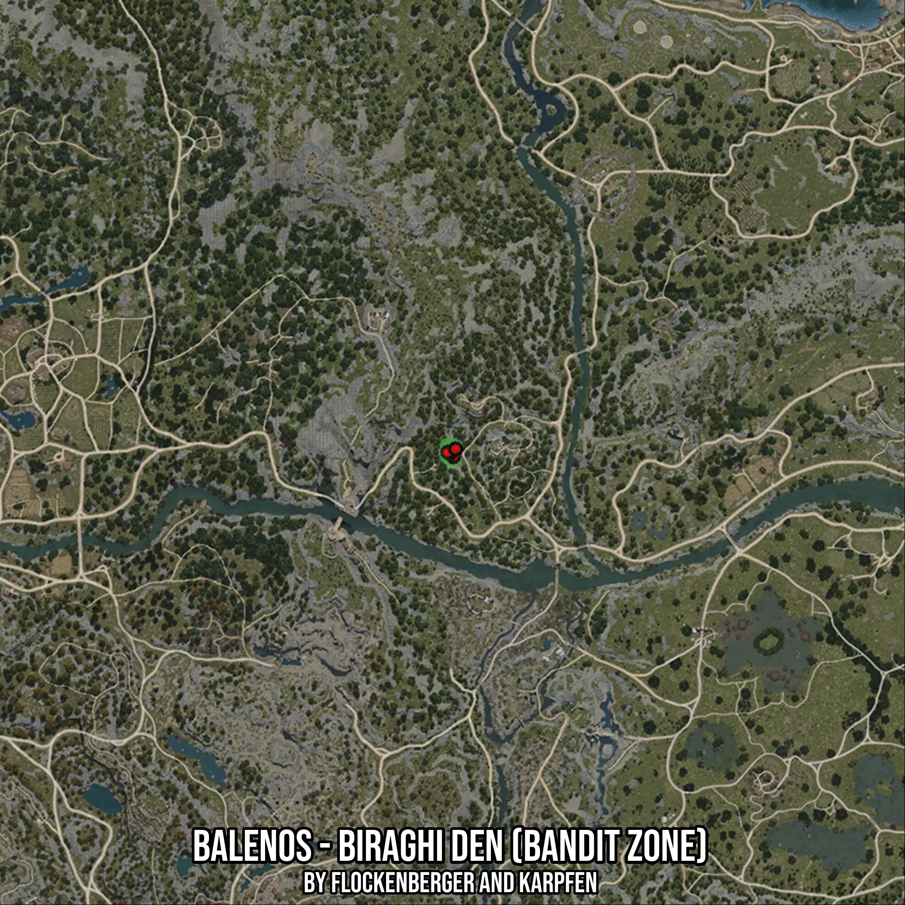

# Balenos - Biraghi Den (Bandit Zone)
Created by **flockenberger**

- **Red Points**: Exact in-game waypoints.
- **Colored Areas**: Entire area where the fishing table is consistent.
## ⚠️ Info about your float:
To verify your fishing position without modifying your files, you can do so [here](https://flockenberger.github.io/bdo-fish-position/).
- Or watch the guide [here](https://youtu.be/t-VXcRoNojk)

## Waypoints
Below you'll find the Copy-Paste ready XML file for this Fishing-Zone.

```xml
	<!--
		Waypoints for: Balenos - Biraghi Den (Bandit Zone)
		Auto-Generated by: flockenberger
		Preview at: https://github.com/Flockenberger/bdo-fish-waypoints/tree/main/Bookmark/Balenos%20-%20Biraghi%20Den%20(Bandit%20Zone)
	-->
	<WorldmapBookMark>
		<BookMark BookMarkName="1: Balenos - Biraghi Den (Bandit Zone)" PosX="-103303.4913778305" PosY="0.0" PosZ="-31623.57008457184" />
		<BookMark BookMarkName="2: Balenos - Biraghi Den (Bandit Zone)" PosX="-103303.4913778305" PosY="0.0" PosZ="-32225.92303752899" />
		<BookMark BookMarkName="3: Balenos - Biraghi Den (Bandit Zone)" PosX="-104207.02080726624" PosY="0.0" PosZ="-31322.39360809326" />
		<BookMark BookMarkName="4: Balenos - Biraghi Den (Bandit Zone)" PosX="-104809.37376022339" PosY="0.0" PosZ="-31021.217131614685" />
		<BookMark BookMarkName="5: Balenos - Biraghi Den (Bandit Zone)" PosX="-102701.13842487335" PosY="0.0" PosZ="-30117.687702178955" />
	</WorldmapBookMark>
```

## Usage Guide
[](https://youtu.be/W-bWmKdv8K8)

## Previews
     

 