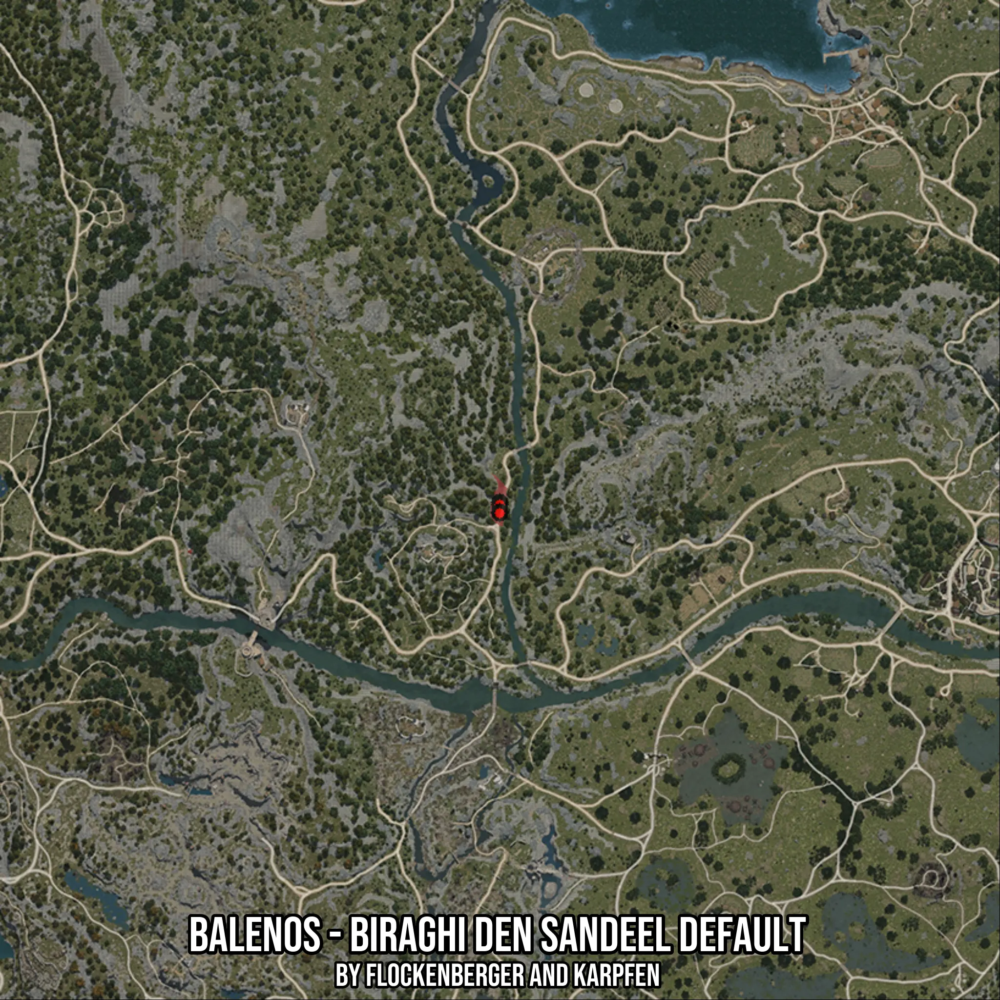

# Balenos - Biraghi Den Sandeel Default
Created by **flockenberger**

- **Red Points**: Exact in-game waypoints.
- **Colored Areas**: Entire area where the fishing table is consistent.
## ⚠️ Info about your float:
To verify your fishing position without modifying your files, you can do so [here](https://flockenberger.github.io/bdo-fish-position/).
- Or watch the guide [here](https://youtu.be/t-VXcRoNojk)

## Waypoints
Below you'll find the Copy-Paste ready XML file for this Fishing-Zone.

```xml
	<!--
		Waypoints for: Balenos - Biraghi Den Sandeel Default
		Auto-Generated by: flockenberger
		Preview at: https://github.com/Flockenberger/bdo-fish-waypoints/tree/main/Bookmark/Balenos%20-%20Biraghi%20Den%20Sandeel%20Default
	-->
	<WorldmapBookMark>
		<BookMark BookMarkName="1: Balenos - Biraghi Den Sandeel Default" PosX="-73788.19668292999" PosY="0.0" PosZ="-16865.922737121582" />
		<BookMark BookMarkName="2: Balenos - Biraghi Den Sandeel Default" PosX="-73788.19668292999" PosY="0.0" PosZ="-17468.275690078735" />
		<BookMark BookMarkName="3: Balenos - Biraghi Den Sandeel Default" PosX="-73788.19668292999" PosY="0.0" PosZ="-17468.275690078735" />
		<BookMark BookMarkName="4: Balenos - Biraghi Den Sandeel Default" PosX="-73788.19668292999" PosY="0.0" PosZ="-19275.334548950195" />
		<BookMark BookMarkName="5: Balenos - Biraghi Den Sandeel Default" PosX="-73788.19668292999" PosY="0.0" PosZ="-19576.511025428772" />
	</WorldmapBookMark>
```

## Usage Guide
[](https://youtu.be/W-bWmKdv8K8)

## Previews
     

 