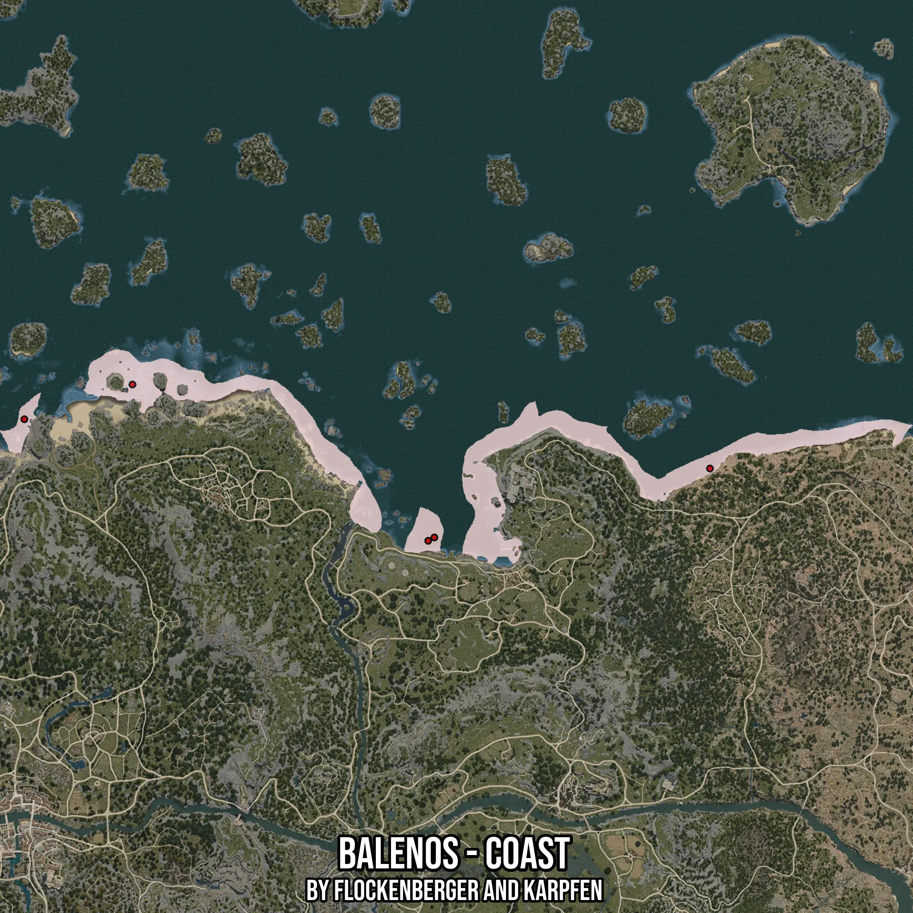

# Balenos - Coast
Created by **flockenberger**

- **Red Points**: Exact in-game waypoints.
- **Colored Areas**: Entire area where the fishing table is consistent.
## ⚠️ Info about your float:
To verify your fishing position without modifying your files, you can do so [here](https://flockenberger.github.io/bdo-fish-position/).
- Or watch the guide [here](https://youtu.be/t-VXcRoNojk)

## Waypoints
Below you'll find the Copy-Paste ready XML file for this Fishing-Zone.

```xml
	<!--
		Waypoints for: Balenos - Coast
		Auto-Generated by: flockenberger
		Preview at: https://github.com/Flockenberger/bdo-fish-waypoints/tree/main/Bookmark/Balenos%20-%20Coast
	-->
	<WorldmapBookMark>
		<BookMark BookMarkName="1: Balenos - Coast" PosX="118663.5717868805" PosY="-8175.0" PosZ="137035.2567434311" />
		<BookMark BookMarkName="2: Balenos - Coast" PosX="-191849.37546253204" PosY="-8175.0" PosZ="182211.7282152176" />
		<BookMark BookMarkName="3: Balenos - Coast" PosX="-32828.19588184357" PosY="-8175.0" PosZ="98183.4912776947" />
		<BookMark BookMarkName="4: Balenos - Coast" PosX="-249976.43542289734" PosY="-8175.0" PosZ="163538.78667354584" />
		<BookMark BookMarkName="5: Balenos - Coast" PosX="-29515.254640579224" PosY="-8175.0" PosZ="99990.55013656616" />
	</WorldmapBookMark>
```

## Usage Guide
[](https://youtu.be/W-bWmKdv8K8)

## Previews
     

 