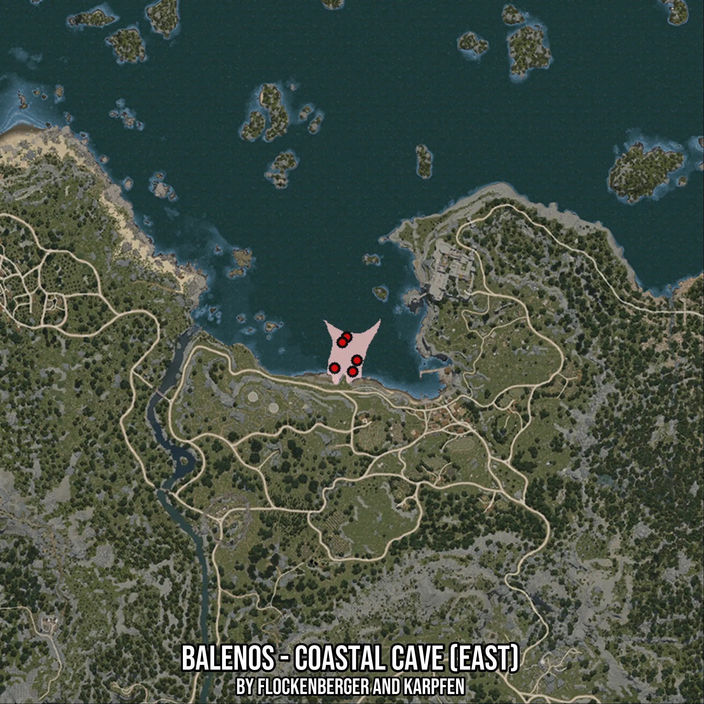

# Balenos - Coastal Cave (East)
Created by **flockenberger**

- **Red Points**: Exact in-game waypoints.
- **Colored Areas**: Entire area where the fishing table is consistent.
## ⚠️ Info about your float:
To verify your fishing position without modifying your files, you can do so [here](https://flockenberger.github.io/bdo-fish-position/).
- Or watch the guide [here](https://youtu.be/t-VXcRoNojk)

## Waypoints
Below you'll find the Copy-Paste ready XML file for this Fishing-Zone.

```xml
	<!--
		Waypoints for: Balenos - Coastal Cave (East)
		Auto-Generated by: flockenberger
		Preview at: https://github.com/Flockenberger/bdo-fish-waypoints/tree/main/Bookmark/Balenos%20-%20Coastal%20Cave%20(East)
	-->
	<WorldmapBookMark>
		<BookMark BookMarkName="1: Balenos - Coastal Cave (East)" PosX="-15962.313199043274" PosY="-8175.0" PosZ="97581.13832473755" />
		<BookMark BookMarkName="2: Balenos - Coastal Cave (East)" PosX="-19576.430916786194" PosY="-8175.0" PosZ="105712.90318965912" />
		<BookMark BookMarkName="3: Balenos - Coastal Cave (East)" PosX="-17468.195581436157" PosY="-8175.0" PosZ="93665.84413051605" />
		<BookMark BookMarkName="4: Balenos - Coastal Cave (East)" PosX="-23792.901587486267" PosY="-8175.0" PosZ="94870.55003643036" />
		<BookMark BookMarkName="5: Balenos - Coastal Cave (East)" PosX="-21082.313299179077" PosY="-8175.0" PosZ="103905.84433078766" />
	</WorldmapBookMark>
```

## Usage Guide
[](https://youtu.be/W-bWmKdv8K8)

## Previews
     

 