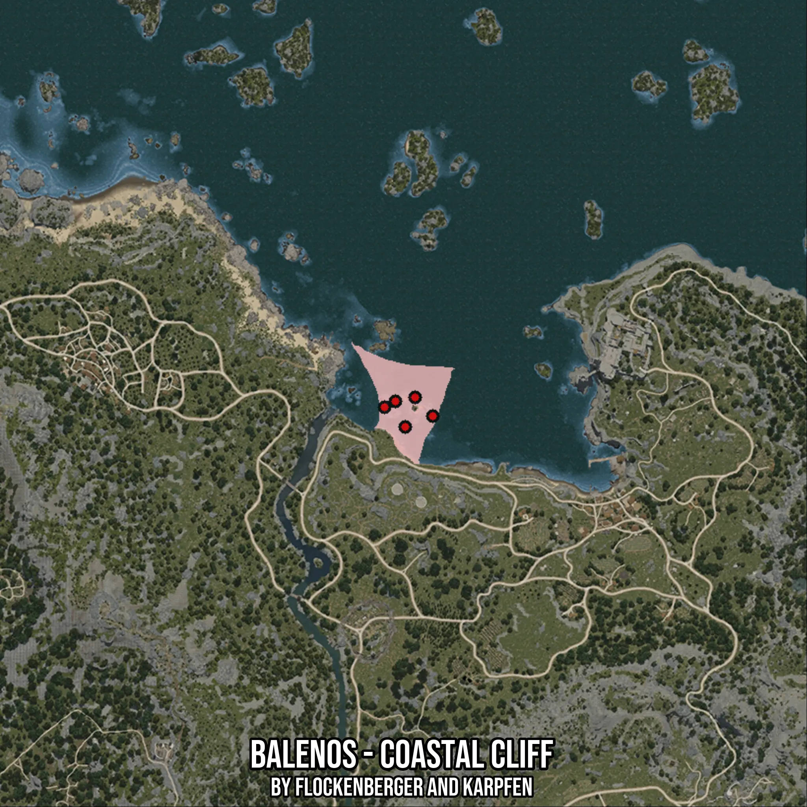

# Balenos - Coastal Cliff
Created by **flockenberger**

- **Red Points**: Exact in-game waypoints.
- **Colored Areas**: Entire area where the fishing table is consistent.
## ⚠️ Info about your float:
To verify your fishing position without modifying your files, you can do so [here](https://flockenberger.github.io/bdo-fish-position/).
- Or watch the guide [here](https://youtu.be/t-VXcRoNojk)

## Waypoints
Below you'll find the Copy-Paste ready XML file for this Fishing-Zone.

```xml
	<!--
		Waypoints for: Balenos - Coastal Cliff
		Auto-Generated by: flockenberger
		Preview at: https://github.com/Flockenberger/bdo-fish-waypoints/tree/main/Bookmark/Balenos%20-%20Coastal%20Cliff
	-->
	<WorldmapBookMark>
		<BookMark BookMarkName="1: Balenos - Coastal Cliff" PosX="-46983.49027633667" PosY="-8175.0" PosZ="112941.13862514496" />
		<BookMark BookMarkName="2: Balenos - Coastal Cliff" PosX="-49995.25504112244" PosY="-8175.0" PosZ="103905.84433078766" />
		<BookMark BookMarkName="3: Balenos - Coastal Cliff" PosX="-56319.96104717255" PosY="-8175.0" PosZ="109929.37386035919" />
		<BookMark BookMarkName="4: Balenos - Coastal Cliff" PosX="-41562.31369972229" PosY="-8175.0" PosZ="107218.785572052" />
		<BookMark BookMarkName="5: Balenos - Coastal Cliff" PosX="-53007.0198059082" PosY="-8175.0" PosZ="111736.43271923065" />
	</WorldmapBookMark>
```

## Usage Guide
[](https://youtu.be/W-bWmKdv8K8)

## Previews
     

 