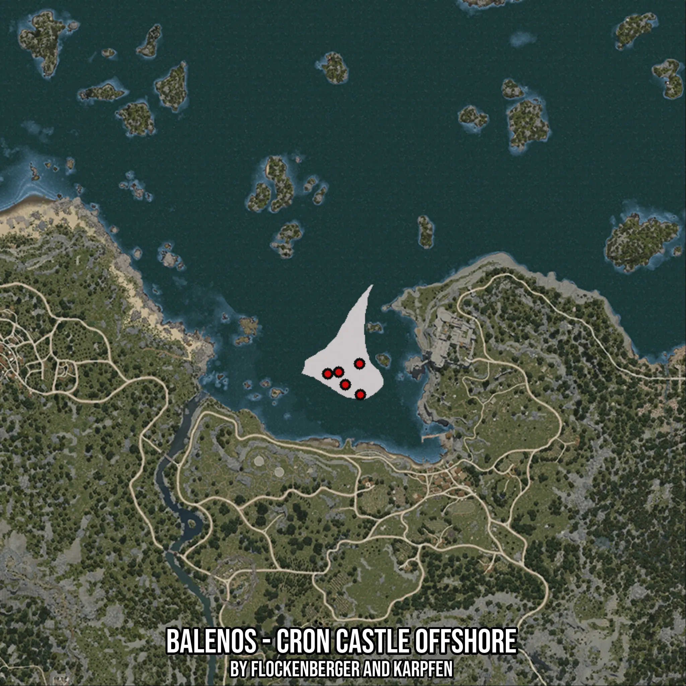

# Balenos - Cron Castle Offshore
Created by **flockenberger**

- **Red Points**: Exact in-game waypoints.
- **Colored Areas**: Entire area where the fishing table is consistent.
## ⚠️ Info about your float:
To verify your fishing position without modifying your files, you can do so [here](https://flockenberger.github.io/bdo-fish-position/).
- Or watch the guide [here](https://youtu.be/t-VXcRoNojk)

## Waypoints
Below you'll find the Copy-Paste ready XML file for this Fishing-Zone.

```xml
	<!--
		Waypoints for: Balenos - Cron Castle Offshore
		Auto-Generated by: flockenberger
		Preview at: https://github.com/Flockenberger/bdo-fish-waypoints/tree/main/Bookmark/Balenos%20-%20Cron%20Castle%20Offshore
	-->
	<WorldmapBookMark>
		<BookMark BookMarkName="1: Balenos - Cron Castle Offshore" PosX="-16263.48967552185" PosY="-8175.0" PosZ="119868.19758415222" />
		<BookMark BookMarkName="2: Balenos - Cron Castle Offshore" PosX="-15962.313199043274" PosY="-8175.0" PosZ="108724.66795444489" />
		<BookMark BookMarkName="3: Balenos - Cron Castle Offshore" PosX="-27708.195781707764" PosY="-8175.0" PosZ="116254.0798664093" />
		<BookMark BookMarkName="4: Balenos - Cron Castle Offshore" PosX="-21383.489775657654" PosY="-8175.0" PosZ="112338.7856721878" />
		<BookMark BookMarkName="5: Balenos - Cron Castle Offshore" PosX="-23792.901587486267" PosY="-8175.0" PosZ="116856.43281936646" />
	</WorldmapBookMark>
```

## Usage Guide
[](https://youtu.be/W-bWmKdv8K8)

## Previews
     

 