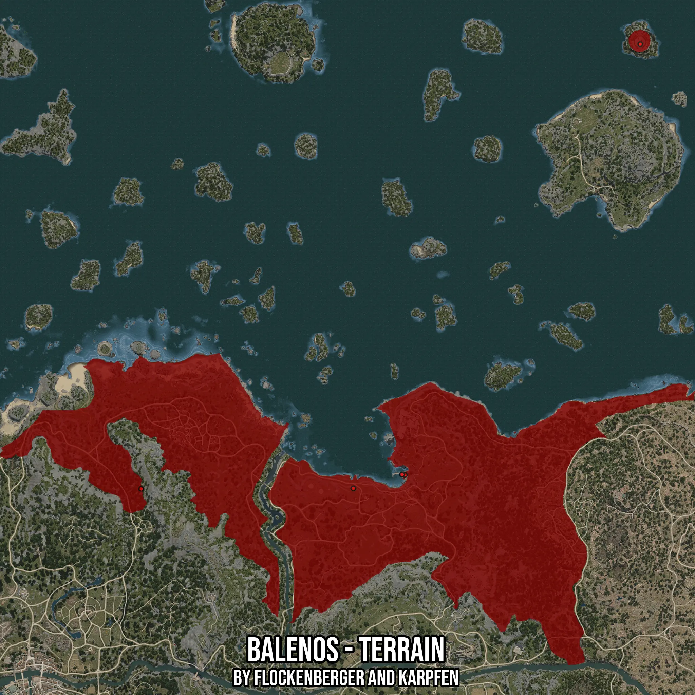

# Balenos - Terrain
Created by **flockenberger**

- **Red Points**: Exact in-game waypoints.
- **Colored Areas**: Entire area where the fishing table is consistent.
## ⚠️ Info about your float:
To verify your fishing position without modifying your files, you can do so [here](https://flockenberger.github.io/bdo-fish-position/).
- Or watch the guide [here](https://youtu.be/t-VXcRoNojk)

## Waypoints
Below you'll find the Copy-Paste ready XML file for this Fishing-Zone.

```xml
	<!--
		Waypoints for: Balenos - Terrain
		Auto-Generated by: flockenberger
		Preview at: https://github.com/Flockenberger/bdo-fish-waypoints/tree/main/Bookmark/Balenos%20-%20Terrain
	-->
	<WorldmapBookMark>
		<BookMark BookMarkName="1: Balenos - Terrain" PosX="-21985.842728614807" PosY="0.0" PosZ="83124.66745376587" />
		<BookMark BookMarkName="2: Balenos - Terrain" PosX="-174381.1398267746" PosY="0.0" PosZ="82823.49097728729" />
		<BookMark BookMarkName="3: Balenos - Terrain" PosX="184018.86718273163" PosY="-8175.0" PosZ="402070.55604457855" />
		<BookMark BookMarkName="4: Balenos - Terrain" PosX="15058.863878250122" PosY="0.0" PosZ="92762.31470108032" />
		<BookMark BookMarkName="5: Balenos - Terrain" PosX="12950.628542900085" PosY="-8175.0" PosZ="93063.4911775589" />
	</WorldmapBookMark>
```

## Usage Guide
[](https://youtu.be/W-bWmKdv8K8)

## Previews
     

 