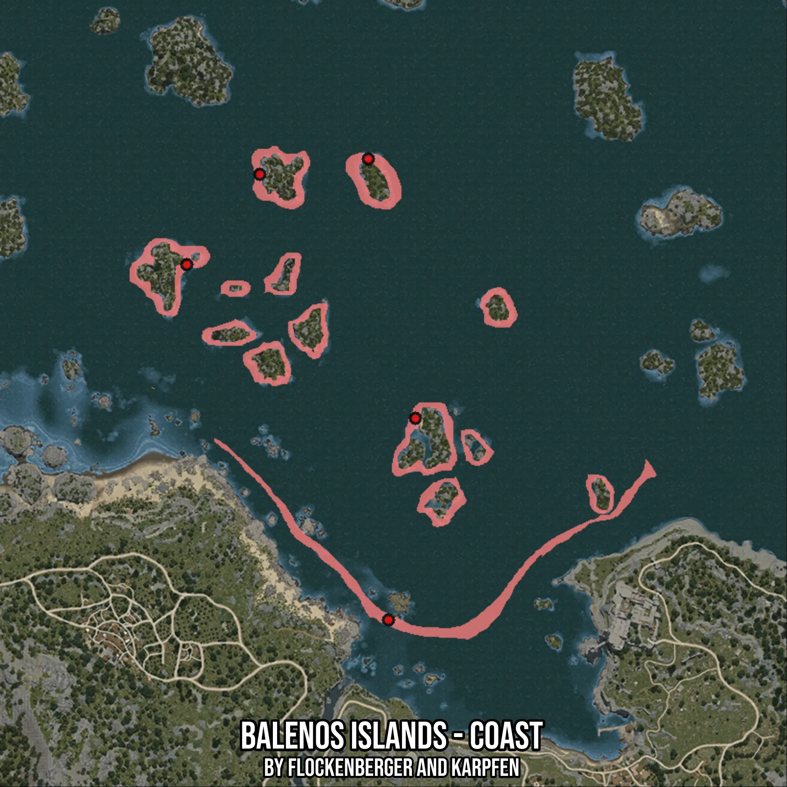

# Balenos Islands - Coast
Created by **flockenberger**

- **Red Points**: Exact in-game waypoints.
- **Colored Areas**: Entire area where the fishing table is consistent.
## ⚠️ Info about your float:
To verify your fishing position without modifying your files, you can do so [here](https://flockenberger.github.io/bdo-fish-position/).
- Or watch the guide [here](https://youtu.be/t-VXcRoNojk)

## Waypoints
Below you'll find the Copy-Paste ready XML file for this Fishing-Zone.

```xml
	<!--
		Waypoints for: Balenos Islands - Coast
		Auto-Generated by: flockenberger
		Preview at: https://github.com/Flockenberger/bdo-fish-waypoints/tree/main/Bookmark/Balenos%20Islands%20-%20Coast
	-->
	<WorldmapBookMark>
		<BookMark BookMarkName="1: Balenos Islands - Coast" PosX="-59632.90228843689" PosY="-8175.0" PosZ="127999.96244907379" />
		<BookMark BookMarkName="2: Balenos Islands - Coast" PosX="-122879.96234893799" PosY="-8175.0" PosZ="239435.25874614716" />
		<BookMark BookMarkName="3: Balenos Islands - Coast" PosX="-65957.608294487" PosY="-8175.0" PosZ="272564.6711587906" />
		<BookMark BookMarkName="4: Balenos Islands - Coast" PosX="-99990.55013656616" PosY="-8175.0" PosZ="267745.84753513336" />
		<BookMark BookMarkName="5: Balenos Islands - Coast" PosX="-51199.96094703674" PosY="-8175.0" PosZ="191247.0225095749" />
	</WorldmapBookMark>
```

## Usage Guide
[](https://youtu.be/W-bWmKdv8K8)

## Previews
     

 