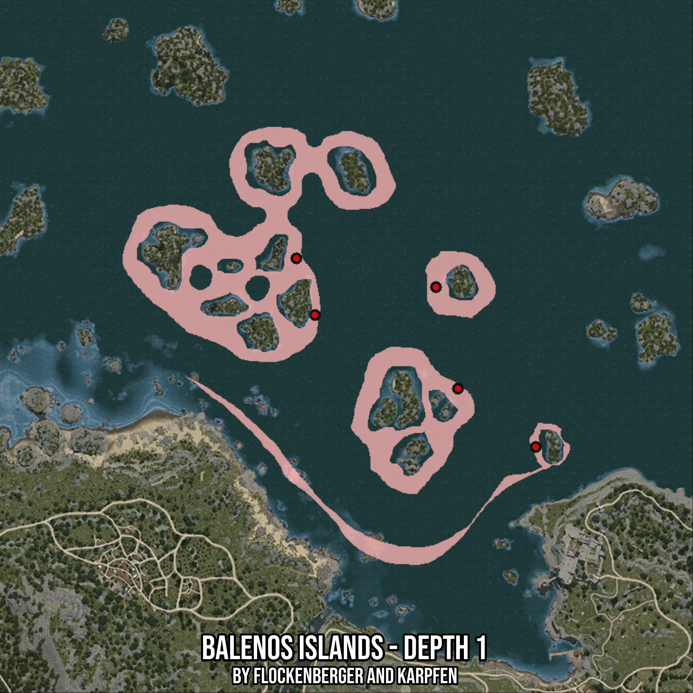

# Balenos Islands - Depth 1
Created by **flockenberger**

- **Red Points**: Exact in-game waypoints.
- **Colored Areas**: Entire area where the fishing table is consistent.
## ⚠️ Info about your float:
To verify your fishing position without modifying your files, you can do so [here](https://flockenberger.github.io/bdo-fish-position/).
- Or watch the guide [here](https://youtu.be/t-VXcRoNojk)

## Waypoints
Below you'll find the Copy-Paste ready XML file for this Fishing-Zone.

```xml
	<!--
		Waypoints for: Balenos Islands - Depth 1
		Auto-Generated by: flockenberger
		Preview at: https://github.com/Flockenberger/bdo-fish-waypoints/tree/main/Bookmark/Balenos%20Islands%20-%20Depth%201
	-->
	<WorldmapBookMark>
		<BookMark BookMarkName="1: Balenos Islands - Depth 1" PosX="-77402.31440067291" PosY="-8175.0" PosZ="214437.6111984253" />
		<BookMark BookMarkName="2: Balenos Islands - Depth 1" PosX="-26503.489875793457" PosY="-8175.0" PosZ="188235.25774478912" />
		<BookMark BookMarkName="3: Balenos Islands - Depth 1" PosX="1204.7459602355957" PosY="-8175.0" PosZ="167454.08086776733" />
		<BookMark BookMarkName="4: Balenos Islands - Depth 1" PosX="-34334.07826423645" PosY="-8175.0" PosZ="224376.43492221832" />
		<BookMark BookMarkName="5: Balenos Islands - Depth 1" PosX="-84028.1968832016" PosY="-8175.0" PosZ="234616.43512248993" />
	</WorldmapBookMark>
```

## Usage Guide
[](https://youtu.be/W-bWmKdv8K8)

## Previews
     

 