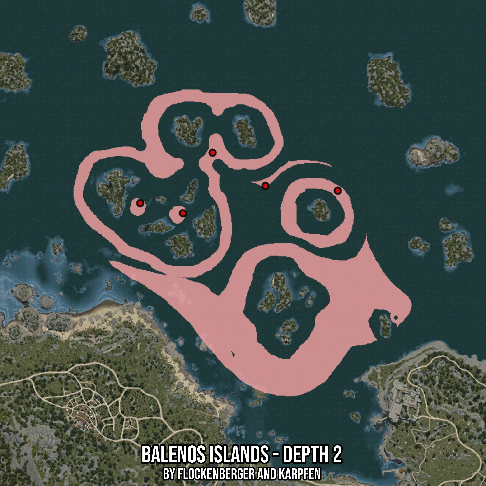

# Balenos Islands - Depth 2
Created by **flockenberger**

- **Red Points**: Exact in-game waypoints.
- **Colored Areas**: Entire area where the fishing table is consistent.
## ⚠️ Info about your float:
To verify your fishing position without modifying your files, you can do so [here](https://flockenberger.github.io/bdo-fish-position/).
- Or watch the guide [here](https://youtu.be/t-VXcRoNojk)

## Waypoints
Below you'll find the Copy-Paste ready XML file for this Fishing-Zone.

```xml
	<!--
		Waypoints for: Balenos Islands - Depth 2
		Auto-Generated by: flockenberger
		Preview at: https://github.com/Flockenberger/bdo-fish-waypoints/tree/main/Bookmark/Balenos%20Islands%20-%20Depth%202
	-->
	<WorldmapBookMark>
		<BookMark BookMarkName="1: Balenos Islands - Depth 2" PosX="-80112.9026889801" PosY="-8175.0" PosZ="255397.61199951172" />
		<BookMark BookMarkName="2: Balenos Islands - Depth 2" PosX="-16564.666152000427" PosY="-8175.0" PosZ="236122.3175048828" />
		<BookMark BookMarkName="3: Balenos Islands - Depth 2" PosX="-53308.19628238678" PosY="-8175.0" PosZ="238531.72931671143" />
		<BookMark BookMarkName="4: Balenos Islands - Depth 2" PosX="-95171.72651290894" PosY="-8175.0" PosZ="224677.6113986969" />
		<BookMark BookMarkName="5: Balenos Islands - Depth 2" PosX="-116856.43281936646" PosY="-8175.0" PosZ="229797.6114988327" />
	</WorldmapBookMark>
```

## Usage Guide
[](https://youtu.be/W-bWmKdv8K8)

## Previews
     

 