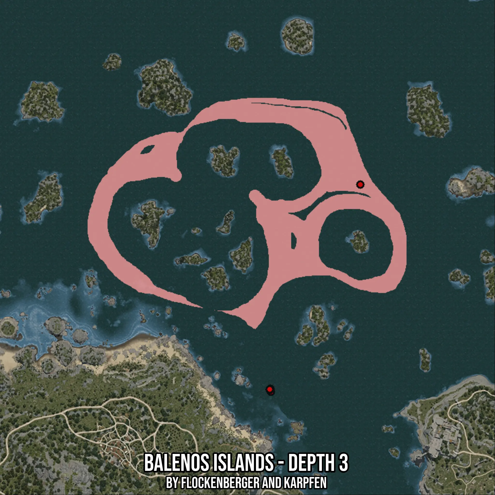

# Balenos Islands - Depth 3
Created by **flockenberger**

- **Red Points**: Exact in-game waypoints.
- **Colored Areas**: Entire area where the fishing table is consistent.
## ⚠️ Info about your float:
To verify your fishing position without modifying your files, you can do so [here](https://flockenberger.github.io/bdo-fish-position/).
- Or watch the guide [here](https://youtu.be/t-VXcRoNojk)

## Waypoints
Below you'll find the Copy-Paste ready XML file for this Fishing-Zone.

```xml
	<!--
		Waypoints for: Balenos Islands - Depth 3
		Auto-Generated by: flockenberger
		Preview at: https://github.com/Flockenberger/bdo-fish-waypoints/tree/main/Bookmark/Balenos%20Islands%20-%20Depth%203
	-->
	<WorldmapBookMark>
		<BookMark BookMarkName="1: Balenos Islands - Depth 3" PosX="-24696.431016921997" PosY="-8175.0" PosZ="254795.25904655457" />
		<BookMark BookMarkName="2: Balenos Islands - Depth 3" PosX="-69571.72601222992" PosY="-8175.0" PosZ="152997.60999679565" />
		<BookMark BookMarkName="3: Balenos Islands - Depth 3" PosX="-69270.54953575134" PosY="-8175.0" PosZ="151491.72761440277" />
		<BookMark BookMarkName="4: Balenos Islands - Depth 3" PosX="-69872.9024887085" PosY="-8175.0" PosZ="152395.2570438385" />
		<BookMark BookMarkName="5: Balenos Islands - Depth 3" PosX="-69872.9024887085" PosY="-8175.0" PosZ="152696.43352031708" />
	</WorldmapBookMark>
```

## Usage Guide
[](https://youtu.be/W-bWmKdv8K8)

## Previews
     

 