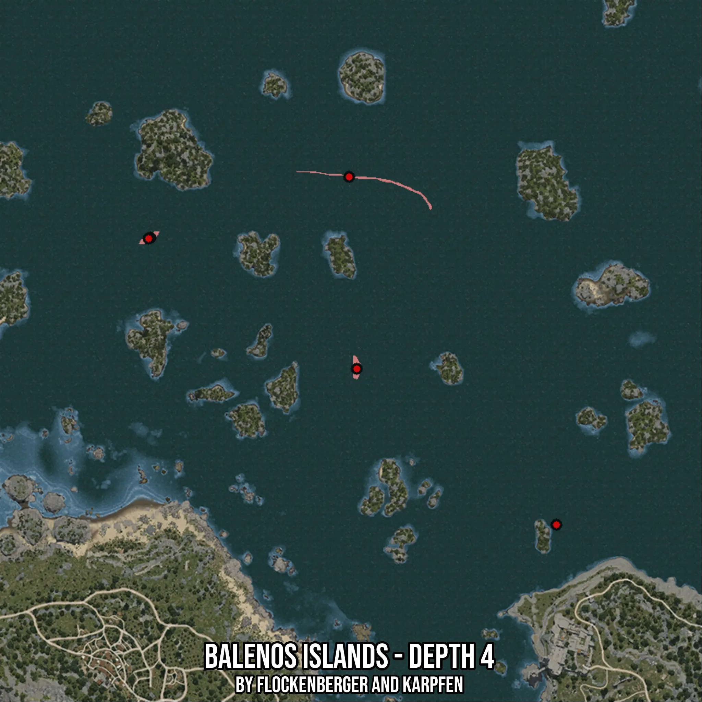

# Balenos Islands - Depth 4
Created by **flockenberger**

- **Red Points**: Exact in-game waypoints.
- **Colored Areas**: Entire area where the fishing table is consistent.
## ⚠️ Info about your float:
To verify your fishing position without modifying your files, you can do so [here](https://flockenberger.github.io/bdo-fish-position/).
- Or watch the guide [here](https://youtu.be/t-VXcRoNojk)

## Waypoints
Below you'll find the Copy-Paste ready XML file for this Fishing-Zone.

```xml
	<!--
		Waypoints for: Balenos Islands - Depth 4
		Auto-Generated by: flockenberger
		Preview at: https://github.com/Flockenberger/bdo-fish-waypoints/tree/main/Bookmark/Balenos%20Islands%20-%20Depth%204
	-->
	<WorldmapBookMark>
		<BookMark BookMarkName="1: Balenos Islands - Depth 4" PosX="-60536.43171787262" PosY="-8175.0" PosZ="293647.02451229095" />
		<BookMark BookMarkName="2: Balenos Islands - Depth 4" PosX="-57825.84342956543" PosY="-8175.0" PosZ="226183.49378108978" />
		<BookMark BookMarkName="3: Balenos Islands - Depth 4" PosX="-130409.3742609024" PosY="-8175.0" PosZ="272263.494682312" />
		<BookMark BookMarkName="4: Balenos Islands - Depth 4" PosX="12348.275589942932" PosY="-8175.0" PosZ="171369.37506198883" />
		<BookMark BookMarkName="5: Balenos Islands - Depth 4" PosX="-131011.72721385956" PosY="-8175.0" PosZ="271962.31820583344" />
	</WorldmapBookMark>
```

## Usage Guide
[](https://youtu.be/W-bWmKdv8K8)

## Previews
     

 