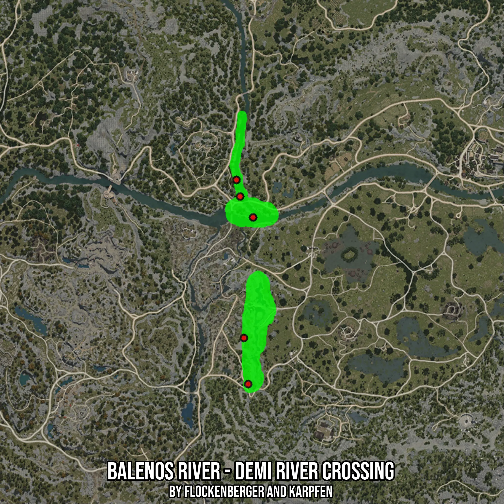

# Balenos River - Demi River Crossing
Created by **flockenberger**

- **Red Points**: Exact in-game waypoints.
- **Colored Areas**: Entire area where the fishing table is consistent.
## ⚠️ Info about your float:
To verify your fishing position without modifying your files, you can do so [here](https://flockenberger.github.io/bdo-fish-position/).
- Or watch the guide [here](https://youtu.be/t-VXcRoNojk)

## Waypoints
Below you'll find the Copy-Paste ready XML file for this Fishing-Zone.

```xml
	<!--
		Waypoints for: Balenos River - Demi River Crossing
		Auto-Generated by: flockenberger
		Preview at: https://github.com/Flockenberger/bdo-fish-waypoints/tree/main/Bookmark/Balenos%20River%20-%20Demi%20River%20Crossing
	-->
	<WorldmapBookMark>
		<BookMark BookMarkName="1: Balenos River - Demi River Crossing" PosX="-66861.13772392273" PosY="0.0" PosZ="-146070.63114643097" />
		<BookMark BookMarkName="2: Balenos River - Demi River Crossing" PosX="-72583.49077701569" PosY="0.0" PosZ="-46080.04095554352" />
		<BookMark BookMarkName="3: Balenos River - Demi River Crossing" PosX="-68969.37305927277" PosY="0.0" PosZ="-123482.39541053772" />
		<BookMark BookMarkName="4: Balenos River - Demi River Crossing" PosX="-70776.43191814423" PosY="0.0" PosZ="-54211.80582046509" />
		<BookMark BookMarkName="5: Balenos River - Demi River Crossing" PosX="-64451.725912094116" PosY="0.0" PosZ="-64451.806020736694" />
	</WorldmapBookMark>
```

## Usage Guide
[](https://youtu.be/W-bWmKdv8K8)

## Previews
     

 