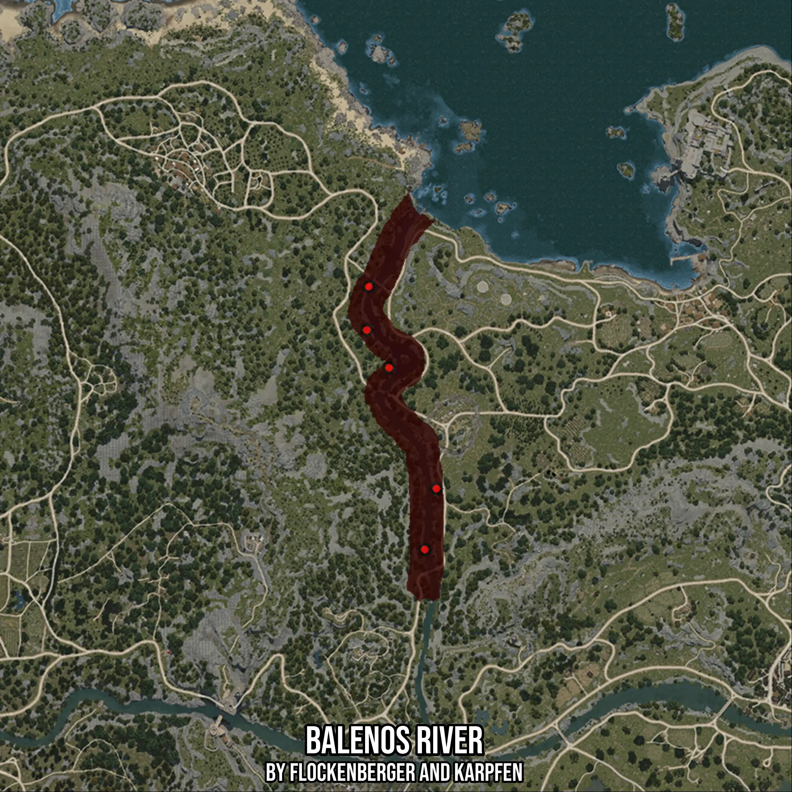

# Balenos River
Created by **flockenberger**

- **Red Points**: Exact in-game waypoints.
- **Colored Areas**: Entire area where the fishing table is consistent.
## ⚠️ Info about your float:
To verify your fishing position without modifying your files, you can do so [here](https://flockenberger.github.io/bdo-fish-position/).
- Or watch the guide [here](https://youtu.be/t-VXcRoNojk)

## Waypoints
Below you'll find the Copy-Paste ready XML file for this Fishing-Zone.

```xml
	<!--
		Waypoints for: Balenos River
		Auto-Generated by: flockenberger
		Preview at: https://github.com/Flockenberger/bdo-fish-waypoints/tree/main/Bookmark/Balenos%20River
	-->
	<WorldmapBookMark>
		<BookMark BookMarkName="1: Balenos River" PosX="-81618.78507137299" PosY="0.0" PosZ="59632.90228843689" />
		<BookMark BookMarkName="2: Balenos River" PosX="-66861.13772392273" PosY="0.0" PosZ="21985.842728614807" />
		<BookMark BookMarkName="3: Balenos River" PosX="-87943.4910774231" PosY="0.0" PosZ="84931.72631263733" />
		<BookMark BookMarkName="4: Balenos River" PosX="-70475.25544166565" PosY="0.0" PosZ="3011.7247104644775" />
		<BookMark BookMarkName="5: Balenos River" PosX="-88545.84403038025" PosY="0.0" PosZ="71378.78487110138" />
	</WorldmapBookMark>
```

## Usage Guide
[](https://youtu.be/W-bWmKdv8K8)

## Previews
     

 