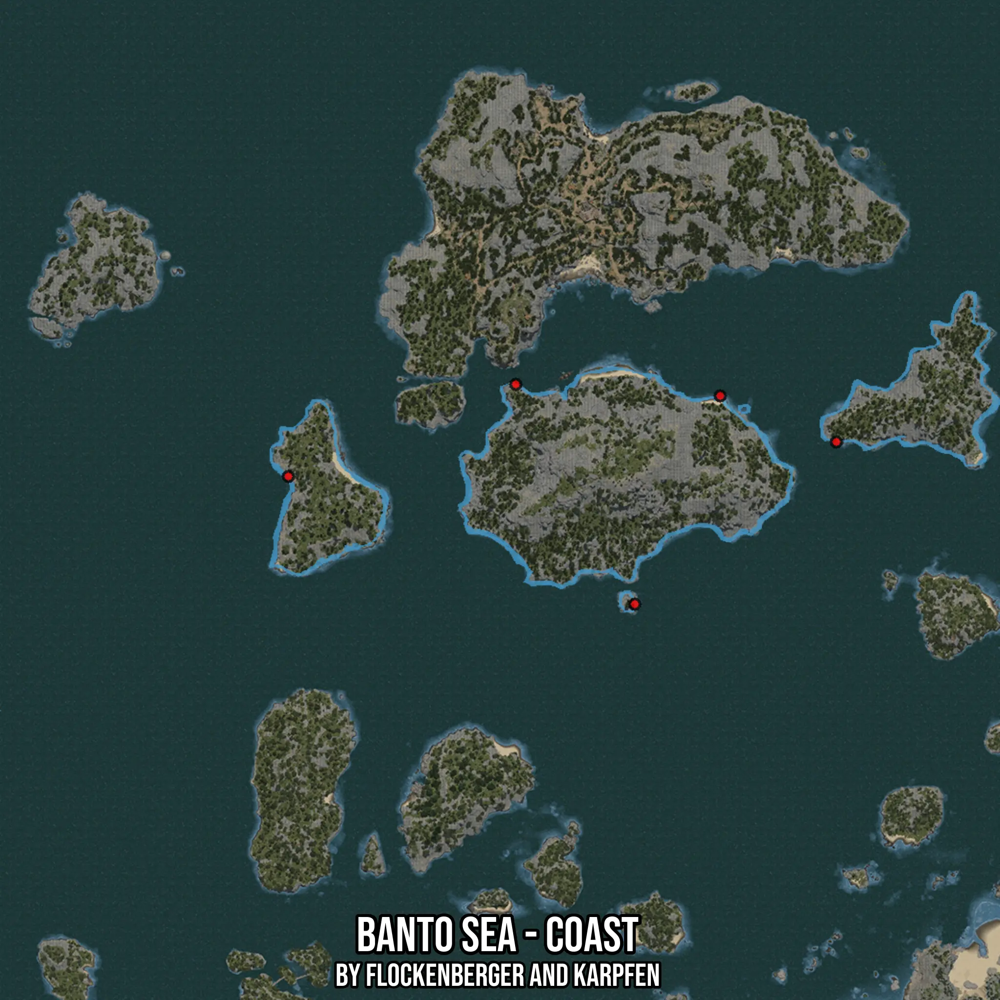

# Banto Sea - Coast
Created by **flockenberger**

- **Red Points**: Exact in-game waypoints.
- **Colored Areas**: Entire area where the fishing table is consistent.
## ⚠️ Info about your float:
To verify your fishing position without modifying your files, you can do so [here](https://flockenberger.github.io/bdo-fish-position/).
- Or watch the guide [here](https://youtu.be/t-VXcRoNojk)

## Waypoints
Below you'll find the Copy-Paste ready XML file for this Fishing-Zone.

```xml
	<!--
		Waypoints for: Banto Sea - Coast
		Auto-Generated by: flockenberger
		Preview at: https://github.com/Flockenberger/bdo-fish-waypoints/tree/main/Bookmark/Banto%20Sea%20-%20Coast
	-->
	<WorldmapBookMark>
		<BookMark BookMarkName="1: Banto Sea - Coast" PosX="-308103.49538326263" PosY="-8175.0" PosZ="337919.9665546417" />
		<BookMark BookMarkName="2: Banto Sea - Coast" PosX="-271661.14172935486" PosY="-8175.0" PosZ="323463.49568367004" />
		<BookMark BookMarkName="3: Banto Sea - Coast" PosX="-443632.90979862213" PosY="-8175.0" PosZ="312621.1425304413" />
		<BookMark BookMarkName="4: Banto Sea - Coast" PosX="-334908.20178985596" PosY="-8175.0" PosZ="272564.6711587906" />
		<BookMark BookMarkName="5: Banto Sea - Coast" PosX="-372254.08487319946" PosY="-8175.0" PosZ="341534.08427238464" />
	</WorldmapBookMark>
```

## Usage Guide
[](https://youtu.be/W-bWmKdv8K8)

## Previews
     

 