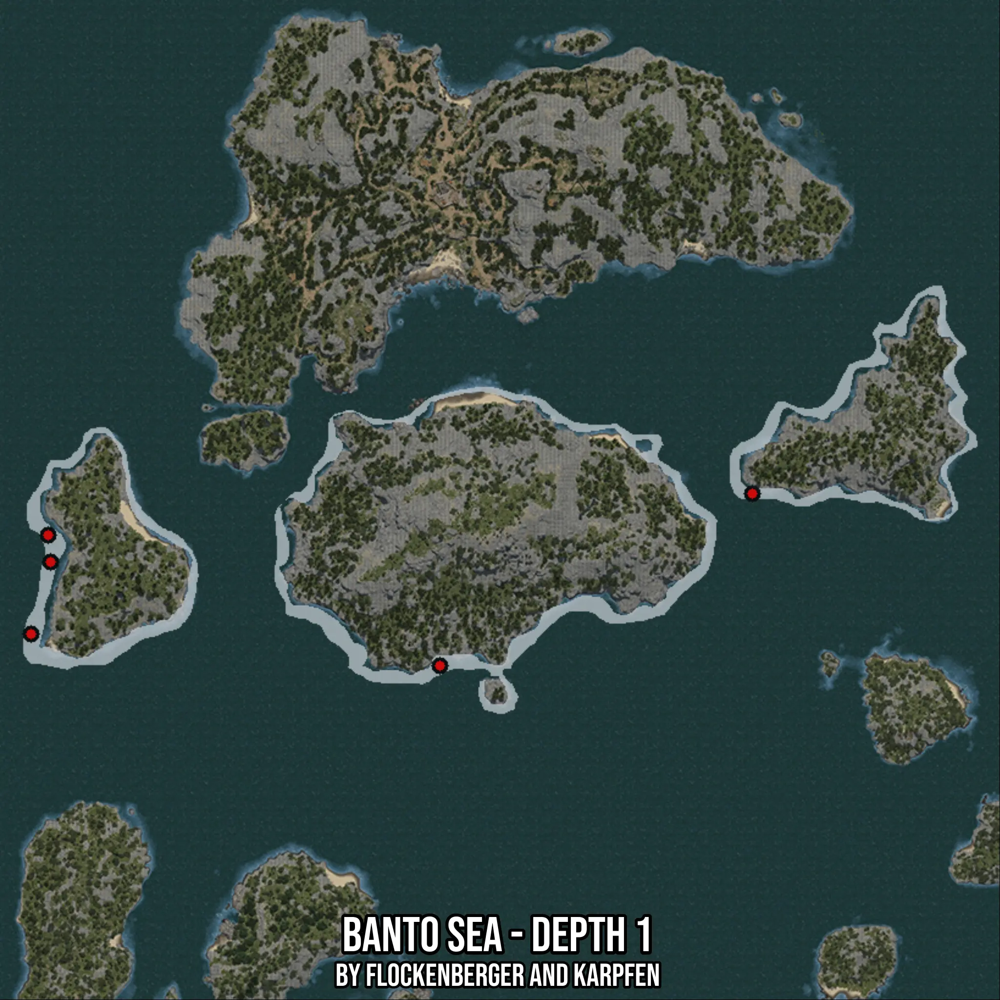

# Banto Sea - Depth 1
Created by **flockenberger**

- **Red Points**: Exact in-game waypoints.
- **Colored Areas**: Entire area where the fishing table is consistent.
## ⚠️ Info about your float:
To verify your fishing position without modifying your files, you can do so [here](https://flockenberger.github.io/bdo-fish-position/).
- Or watch the guide [here](https://youtu.be/t-VXcRoNojk)

## Waypoints
Below you'll find the Copy-Paste ready XML file for this Fishing-Zone.

```xml
	<!--
		Waypoints for: Banto Sea - Depth 1
		Auto-Generated by: flockenberger
		Preview at: https://github.com/Flockenberger/bdo-fish-waypoints/tree/main/Bookmark/Banto%20Sea%20-%20Depth%201
	-->
	<WorldmapBookMark>
		<BookMark BookMarkName="1: Banto Sea - Depth 1" PosX="-350870.5550432205" PosY="-8175.0" PosZ="279491.73011779785" />
		<BookMark BookMarkName="2: Banto Sea - Depth 1" PosX="-451764.6746635437" PosY="-8175.0" PosZ="287322.31850624084" />
		<BookMark BookMarkName="3: Banto Sea - Depth 1" PosX="-273769.3770647049" PosY="-8175.0" PosZ="321957.61330127716" />
		<BookMark BookMarkName="4: Banto Sea - Depth 1" PosX="-447548.2039928436" PosY="-8175.0" PosZ="311717.61310100555" />
		<BookMark BookMarkName="5: Banto Sea - Depth 1" PosX="-446945.8510398865" PosY="-8175.0" PosZ="305091.73061847687" />
	</WorldmapBookMark>
```

## Usage Guide
[](https://youtu.be/W-bWmKdv8K8)

## Previews
     

 