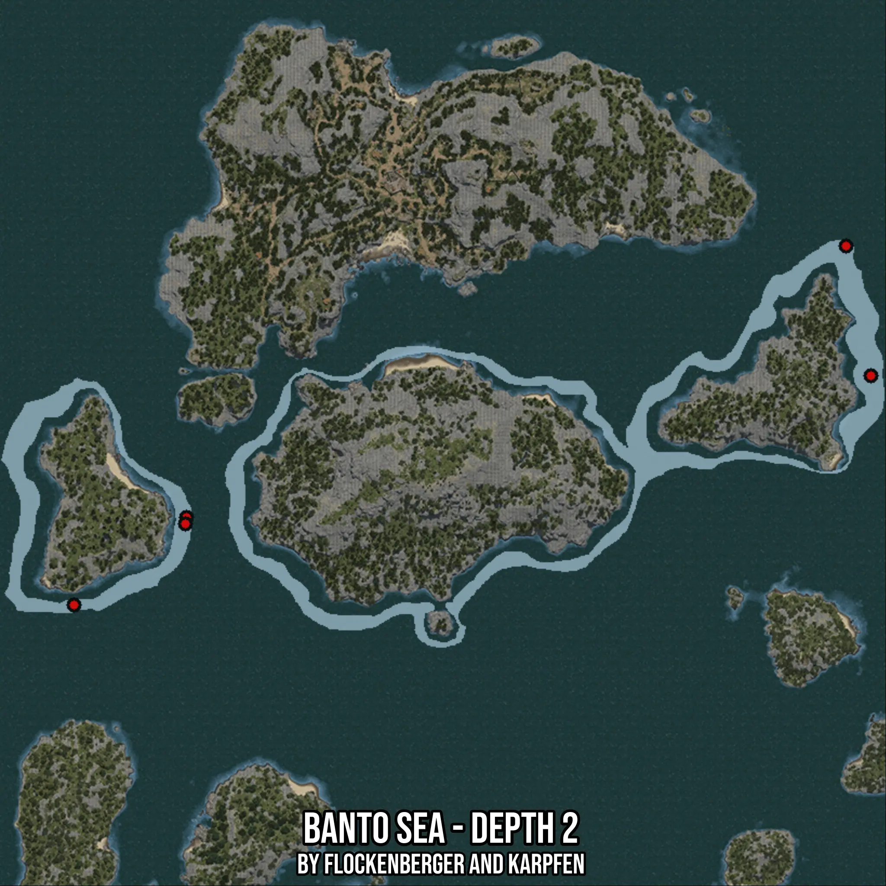

# Banto Sea - Depth 2
Created by **flockenberger**

- **Red Points**: Exact in-game waypoints.
- **Colored Areas**: Entire area where the fishing table is consistent.
## ⚠️ Info about your float:
To verify your fishing position without modifying your files, you can do so [here](https://flockenberger.github.io/bdo-fish-position/).
- Or watch the guide [here](https://youtu.be/t-VXcRoNojk)

## Waypoints
Below you'll find the Copy-Paste ready XML file for this Fishing-Zone.

```xml
	<!--
		Waypoints for: Banto Sea - Depth 2
		Auto-Generated by: flockenberger
		Preview at: https://github.com/Flockenberger/bdo-fish-waypoints/tree/main/Bookmark/Banto%20Sea%20-%20Depth%202
	-->
	<WorldmapBookMark>
		<BookMark BookMarkName="1: Banto Sea - Depth 2" PosX="-216847.0230102539" PosY="-8175.0" PosZ="341835.2607488632" />
		<BookMark BookMarkName="2: Banto Sea - Depth 2" PosX="-438814.0861749649" PosY="-8175.0" PosZ="277985.84773540497" />
		<BookMark BookMarkName="3: Banto Sea - Depth 2" PosX="-223774.08196926117" PosY="-8175.0" PosZ="377976.4379262924" />
		<BookMark BookMarkName="4: Banto Sea - Depth 2" PosX="-407491.73262119293" PosY="-8175.0" PosZ="302381.1423301697" />
		<BookMark BookMarkName="5: Banto Sea - Depth 2" PosX="-407792.9090976715" PosY="-8175.0" PosZ="300574.0834712982" />
	</WorldmapBookMark>
```

## Usage Guide
[](https://youtu.be/W-bWmKdv8K8)

## Previews
     

 