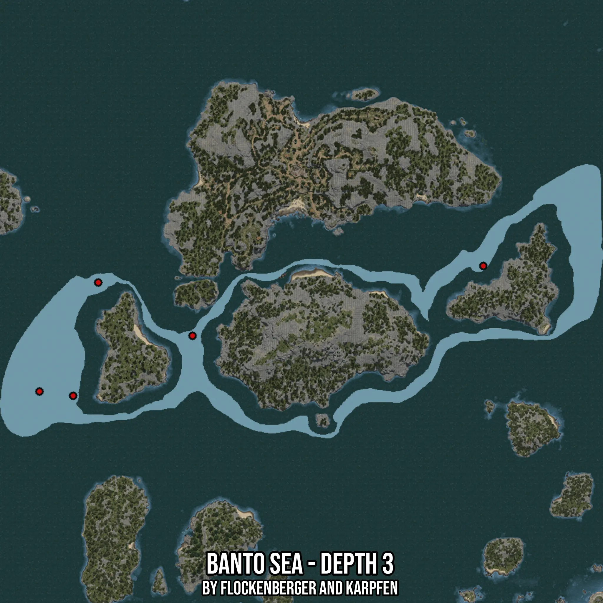

# Banto Sea - Depth 3
Created by **flockenberger**

- **Red Points**: Exact in-game waypoints.
- **Colored Areas**: Entire area where the fishing table is consistent.
## ⚠️ Info about your float:
To verify your fishing position without modifying your files, you can do so [here](https://flockenberger.github.io/bdo-fish-position/).
- Or watch the guide [here](https://youtu.be/t-VXcRoNojk)

## Waypoints
Below you'll find the Copy-Paste ready XML file for this Fishing-Zone.

```xml
	<!--
		Waypoints for: Banto Sea - Depth 3
		Auto-Generated by: flockenberger
		Preview at: https://github.com/Flockenberger/bdo-fish-waypoints/tree/main/Bookmark/Banto%20Sea%20-%20Depth%203
	-->
	<WorldmapBookMark>
		<BookMark BookMarkName="1: Banto Sea - Depth 3" PosX="-257807.02381134033" PosY="-8175.0" PosZ="349063.49618434906" />
		<BookMark BookMarkName="2: Banto Sea - Depth 3" PosX="-459595.2630519867" PosY="-8175.0" PosZ="285214.0831708908" />
		<BookMark BookMarkName="3: Banto Sea - Depth 3" PosX="-400865.85013866425" PosY="-8175.0" PosZ="314729.3778657913" />
		<BookMark BookMarkName="4: Banto Sea - Depth 3" PosX="-476159.9692583084" PosY="-8175.0" PosZ="287322.31850624084" />
		<BookMark BookMarkName="5: Banto Sea - Depth 3" PosX="-447247.02751636505" PosY="-8175.0" PosZ="340931.7313194275" />
	</WorldmapBookMark>
```

## Usage Guide
[](https://youtu.be/W-bWmKdv8K8)

## Previews
     

 