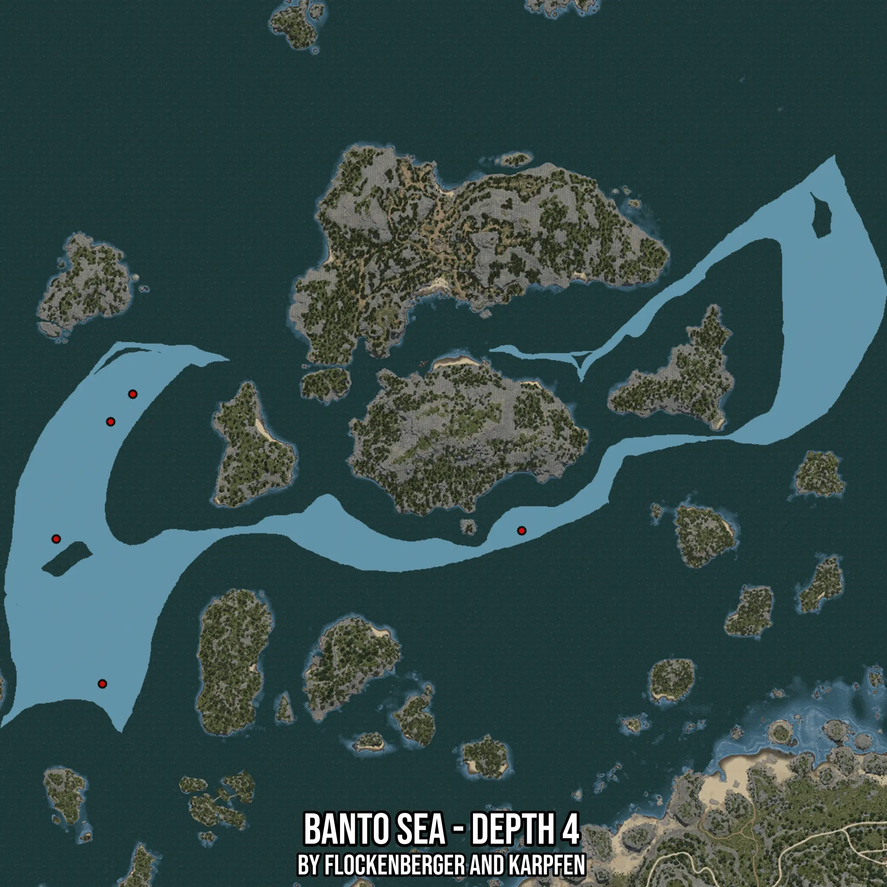

# Banto Sea - Depth 4
Created by **flockenberger**

- **Red Points**: Exact in-game waypoints.
- **Colored Areas**: Entire area where the fishing table is consistent.
## ⚠️ Info about your float:
To verify your fishing position without modifying your files, you can do so [here](https://flockenberger.github.io/bdo-fish-position/).
- Or watch the guide [here](https://youtu.be/t-VXcRoNojk)

## Waypoints
Below you'll find the Copy-Paste ready XML file for this Fishing-Zone.

```xml
	<!--
		Waypoints for: Banto Sea - Depth 4
		Auto-Generated by: flockenberger
		Preview at: https://github.com/Flockenberger/bdo-fish-waypoints/tree/main/Bookmark/Banto%20Sea%20-%20Depth%204
	-->
	<WorldmapBookMark>
		<BookMark BookMarkName="1: Banto Sea - Depth 4" PosX="-496639.9696588516" PosY="-8175.0" PosZ="204498.78747463226" />
		<BookMark BookMarkName="2: Banto Sea - Depth 4" PosX="-483388.20469379425" PosY="-8175.0" PosZ="330992.90759563446" />
		<BookMark BookMarkName="3: Banto Sea - Depth 4" PosX="-493025.8519411087" PosY="-8175.0" PosZ="318945.8485364914" />
		<BookMark BookMarkName="4: Banto Sea - Depth 4" PosX="-516818.79358291626" PosY="-8175.0" PosZ="267745.84753513336" />
		<BookMark BookMarkName="5: Banto Sea - Depth 4" PosX="-313524.671959877" PosY="-8175.0" PosZ="271359.9652528763" />
	</WorldmapBookMark>
```

## Usage Guide
[](https://youtu.be/W-bWmKdv8K8)

## Previews
     

 