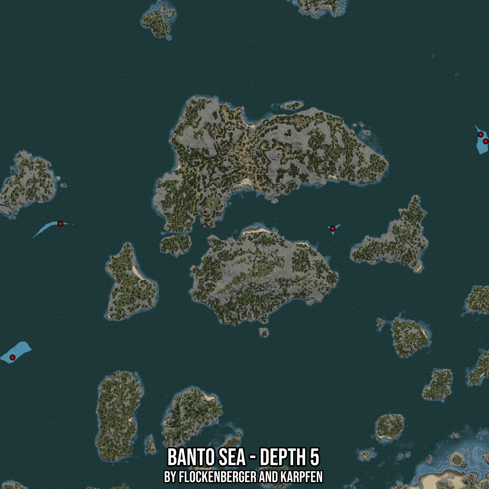

# Banto Sea - Depth 5
Created by **flockenberger**

- **Red Points**: Exact in-game waypoints.
- **Colored Areas**: Entire area where the fishing table is consistent.
## ⚠️ Info about your float:
To verify your fishing position without modifying your files, you can do so [here](https://flockenberger.github.io/bdo-fish-position/).
- Or watch the guide [here](https://youtu.be/t-VXcRoNojk)

## Waypoints
Below you'll find the Copy-Paste ready XML file for this Fishing-Zone.

```xml
	<!--
		Waypoints for: Banto Sea - Depth 5
		Auto-Generated by: flockenberger
		Preview at: https://github.com/Flockenberger/bdo-fish-waypoints/tree/main/Bookmark/Banto%20Sea%20-%20Depth%205
	-->
	<WorldmapBookMark>
		<BookMark BookMarkName="1: Banto Sea - Depth 5" PosX="-514409.38177108765" PosY="-8175.0" PosZ="255397.61199951172" />
		<BookMark BookMarkName="2: Banto Sea - Depth 5" PosX="-180103.49287986755" PosY="-8175.0" PosZ="408094.0855741501" />
		<BookMark BookMarkName="3: Banto Sea - Depth 5" PosX="-480677.61640548706" PosY="-8175.0" PosZ="349967.0256137848" />
		<BookMark BookMarkName="4: Banto Sea - Depth 5" PosX="-288225.8479356766" PosY="-8175.0" PosZ="346352.90789604187" />
		<BookMark BookMarkName="5: Banto Sea - Depth 5" PosX="-183717.61059761047" PosY="-8175.0" PosZ="412912.9091978073" />
	</WorldmapBookMark>
```

## Usage Guide
[](https://youtu.be/W-bWmKdv8K8)

## Previews
     

 