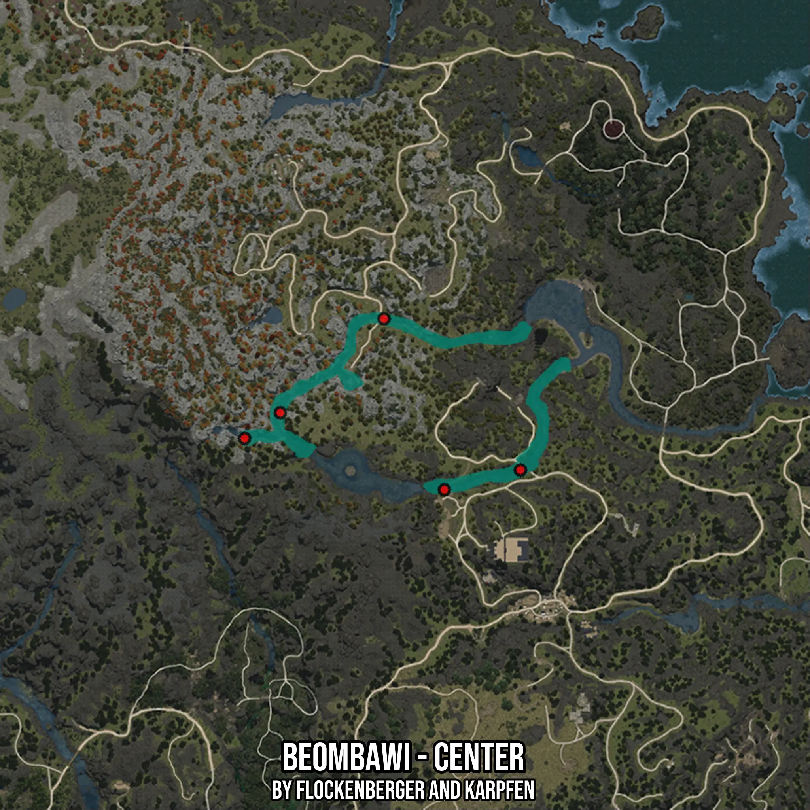

# Beombawi - Center
Created by **flockenberger**

- **Red Points**: Exact in-game waypoints.
- **Colored Areas**: Entire area where the fishing table is consistent.
## ⚠️ Info about your float:
To verify your fishing position without modifying your files, you can do so [here](https://flockenberger.github.io/bdo-fish-position/).
- Or watch the guide [here](https://youtu.be/t-VXcRoNojk)

## Waypoints
Below you'll find the Copy-Paste ready XML file for this Fishing-Zone.

```xml
	<!--
		Waypoints for: Beombawi - Center
		Auto-Generated by: flockenberger
		Preview at: https://github.com/Flockenberger/bdo-fish-waypoints/tree/main/Bookmark/Beombawi%20-%20Center
	-->
	<WorldmapBookMark>
		<BookMark BookMarkName="1: Beombawi - Center" PosX="-1215849.3954896927" PosY="0.0" PosZ="1324272.9270219803" />
		<BookMark BookMarkName="2: Beombawi - Center" PosX="-1155011.7472410202" PosY="0.0" PosZ="1308611.7502450943" />
		<BookMark BookMarkName="3: Beombawi - Center" PosX="-1205007.042336464" PosY="0.0" PosZ="1332103.5154104233" />
		<BookMark BookMarkName="4: Beombawi - Center" PosX="-1131821.1585521698" PosY="0.0" PosZ="1314635.2797746658" />
		<BookMark BookMarkName="5: Beombawi - Center" PosX="-1173383.5123062134" PosY="0.0" PosZ="1360715.280675888" />
	</WorldmapBookMark>
```

## Usage Guide
[](https://youtu.be/W-bWmKdv8K8)

## Previews
     

 