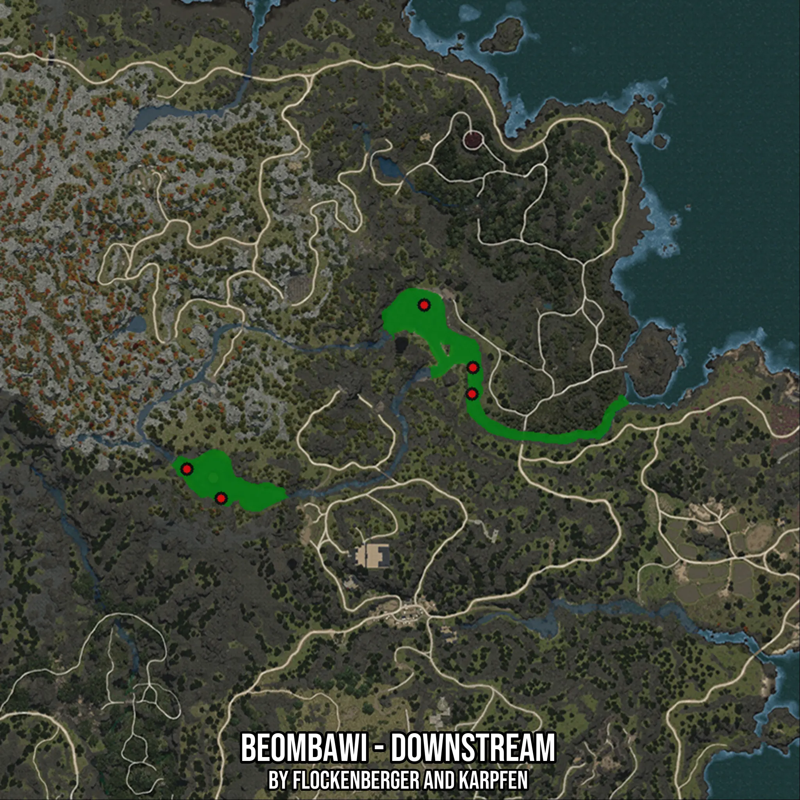

# Beombawi - Downstream
Created by **flockenberger**

- **Red Points**: Exact in-game waypoints.
- **Colored Areas**: Entire area where the fishing table is consistent.
## ⚠️ Info about your float:
To verify your fishing position without modifying your files, you can do so [here](https://flockenberger.github.io/bdo-fish-position/).
- Or watch the guide [here](https://youtu.be/t-VXcRoNojk)

## Waypoints
Below you'll find the Copy-Paste ready XML file for this Fishing-Zone.

```xml
	<!--
		Waypoints for: Beombawi - Downstream
		Auto-Generated by: flockenberger
		Preview at: https://github.com/Flockenberger/bdo-fish-waypoints/tree/main/Bookmark/Beombawi%20-%20Downstream
	-->
	<WorldmapBookMark>
		<BookMark BookMarkName="1: Beombawi - Downstream" PosX="-1103510.5697631836" PosY="0.0" PosZ="1348367.0451402664" />
		<BookMark BookMarkName="2: Beombawi - Downstream" PosX="-1191755.2773714066" PosY="0.0" PosZ="1317044.6915864944" />
		<BookMark BookMarkName="3: Beombawi - Downstream" PosX="-1118569.3935871124" PosY="0.0" PosZ="1367642.3396348953" />
		<BookMark BookMarkName="4: Beombawi - Downstream" PosX="-1181214.1006946564" PosY="0.0" PosZ="1308009.3972921371" />
		<BookMark BookMarkName="5: Beombawi - Downstream" PosX="-1103811.7462396622" PosY="0.0" PosZ="1340235.2802753448" />
	</WorldmapBookMark>
```

## Usage Guide
[](https://youtu.be/W-bWmKdv8K8)

## Previews
     

 