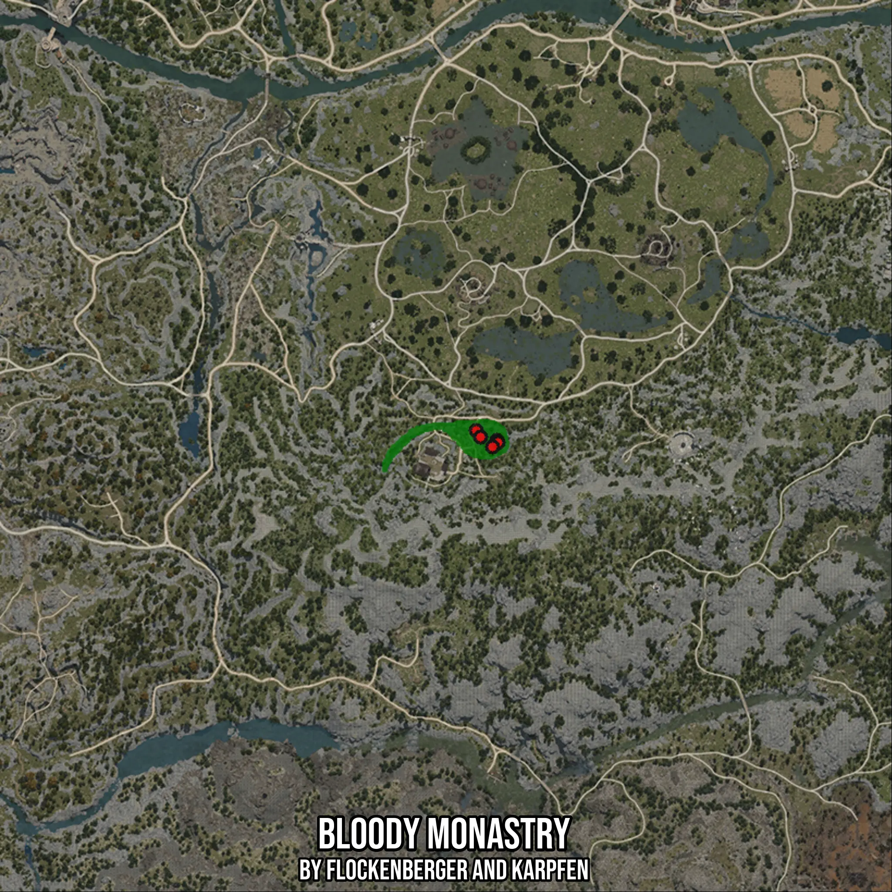

# Bloody Monastry
Created by **flockenberger**

- **Red Points**: Exact in-game waypoints.
- **Colored Areas**: Entire area where the fishing table is consistent.
## ⚠️ Info about your float:
To verify your fishing position without modifying your files, you can do so [here](https://flockenberger.github.io/bdo-fish-position/).
- Or watch the guide [here](https://youtu.be/t-VXcRoNojk)

## Waypoints
Below you'll find the Copy-Paste ready XML file for this Fishing-Zone.

```xml
	<!--
		Waypoints for: Bloody Monastry
		Auto-Generated by: flockenberger
		Preview at: https://github.com/Flockenberger/bdo-fish-waypoints/tree/main/Bookmark/Bloody%20Monastry
	-->
	<WorldmapBookMark>
		<BookMark BookMarkName="1: Bloody Monastry" PosX="-17167.01910495758" PosY="0.0" PosZ="-160225.92554092407" />
		<BookMark BookMarkName="2: Bloody Monastry" PosX="-15962.313199043274" PosY="0.0" PosZ="-162032.98439979553" />
		<BookMark BookMarkName="3: Bloody Monastry" PosX="-11444.666051864624" PosY="0.0" PosZ="-162936.51382923126" />
		<BookMark BookMarkName="4: Bloody Monastry" PosX="-11143.489575386047" PosY="0.0" PosZ="-163538.86678218842" />
		<BookMark BookMarkName="5: Bloody Monastry" PosX="-12649.37195777893" PosY="0.0" PosZ="-164743.57268810272" />
	</WorldmapBookMark>
```

## Usage Guide
[](https://youtu.be/W-bWmKdv8K8)

## Previews
     

 