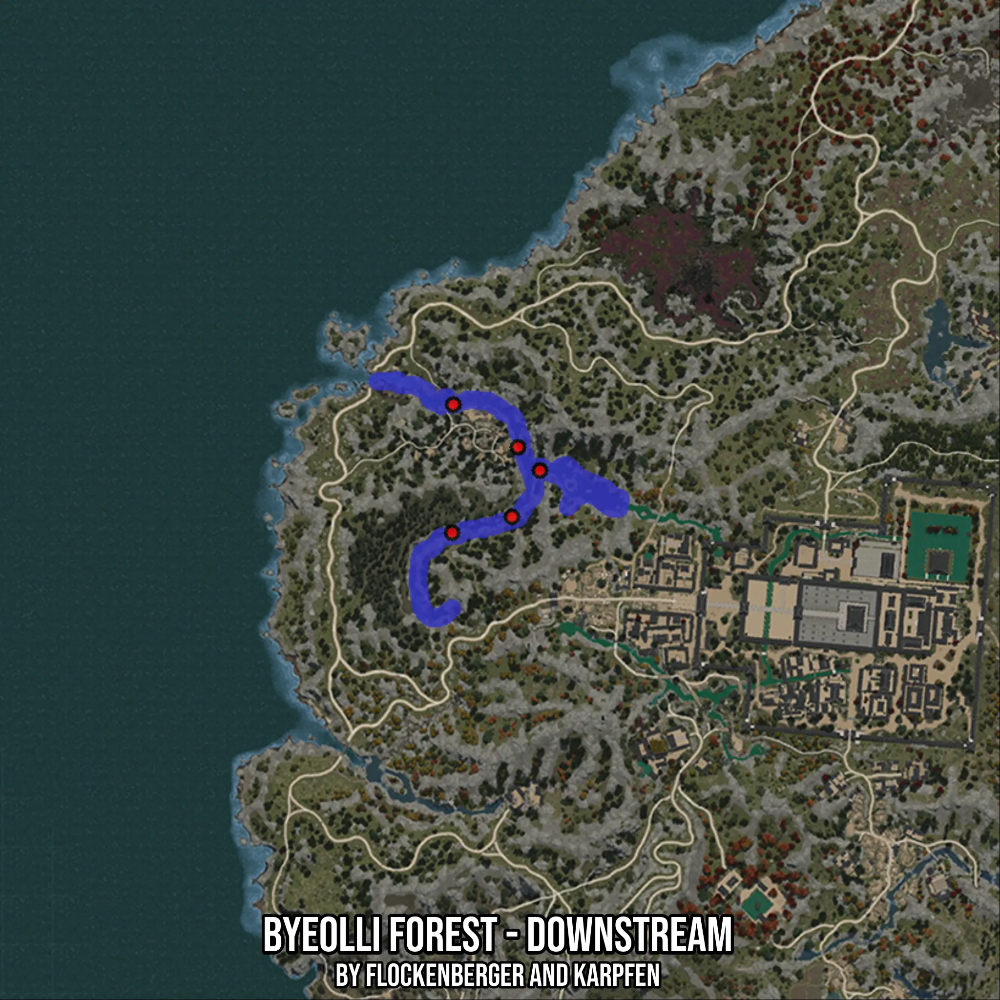

# Byeolli Forest - Downstream
Created by **flockenberger**

- **Red Points**: Exact in-game waypoints.
- **Colored Areas**: Entire area where the fishing table is consistent.
## ⚠️ Info about your float:
To verify your fishing position without modifying your files, you can do so [here](https://flockenberger.github.io/bdo-fish-position/).
- Or watch the guide [here](https://youtu.be/t-VXcRoNojk)

## Waypoints
Below you'll find the Copy-Paste ready XML file for this Fishing-Zone.

```xml
	<!--
		Waypoints for: Byeolli Forest - Downstream
		Auto-Generated by: flockenberger
		Preview at: https://github.com/Flockenberger/bdo-fish-waypoints/tree/main/Bookmark/Byeolli%20Forest%20-%20Downstream
	-->
	<WorldmapBookMark>
		<BookMark BookMarkName="1: Byeolli Forest - Downstream" PosX="-1502569.4010972977" PosY="0.0" PosZ="1358305.8688640594" />
		<BookMark BookMarkName="2: Byeolli Forest - Downstream" PosX="-1517025.8719682693" PosY="0.0" PosZ="1386014.1047000885" />
		<BookMark BookMarkName="3: Byeolli Forest - Downstream" PosX="-1517327.048444748" PosY="0.0" PosZ="1354390.574669838" />
		<BookMark BookMarkName="4: Byeolli Forest - Downstream" PosX="-1501063.5187149048" PosY="0.0" PosZ="1375472.9280233383" />
		<BookMark BookMarkName="5: Byeolli Forest - Downstream" PosX="-1495642.3421382904" PosY="0.0" PosZ="1369750.5749702454" />
	</WorldmapBookMark>
```

## Usage Guide
[](https://youtu.be/W-bWmKdv8K8)

## Previews
     

 