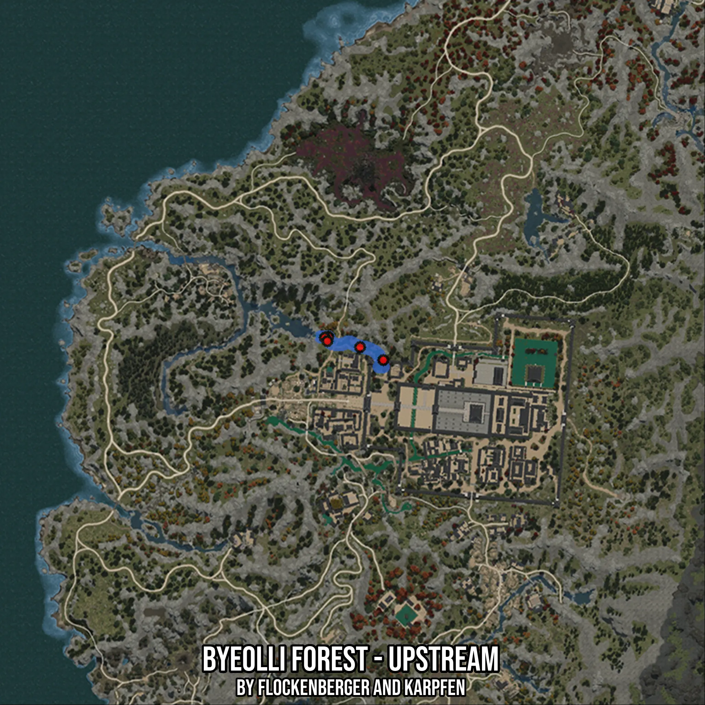

# Byeolli Forest - Upstream
Created by **flockenberger**

- **Red Points**: Exact in-game waypoints.
- **Colored Areas**: Entire area where the fishing table is consistent.
## ⚠️ Info about your float:
To verify your fishing position without modifying your files, you can do so [here](https://flockenberger.github.io/bdo-fish-position/).
- Or watch the guide [here](https://youtu.be/t-VXcRoNojk)

## Waypoints
Below you'll find the Copy-Paste ready XML file for this Fishing-Zone.

```xml
	<!--
		Waypoints for: Byeolli Forest - Upstream
		Auto-Generated by: flockenberger
		Preview at: https://github.com/Flockenberger/bdo-fish-waypoints/tree/main/Bookmark/Byeolli%20Forest%20-%20Upstream
	-->
	<WorldmapBookMark>
		<BookMark BookMarkName="1: Byeolli Forest - Upstream" PosX="-1469439.9886846542" PosY="0.0" PosZ="1360112.927722931" />
		<BookMark BookMarkName="2: Byeolli Forest - Upstream" PosX="-1458296.459054947" PosY="0.0" PosZ="1356498.810005188" />
		<BookMark BookMarkName="3: Byeolli Forest - Upstream" PosX="-1470644.6945905685" PosY="0.0" PosZ="1359811.7512464523" />
		<BookMark BookMarkName="4: Byeolli Forest - Upstream" PosX="-1450164.6941900253" PosY="0.0" PosZ="1351981.1628580093" />
		<BookMark BookMarkName="5: Byeolli Forest - Upstream" PosX="-1469741.1651611328" PosY="0.0" PosZ="1358607.045340538" />
	</WorldmapBookMark>
```

## Usage Guide
[](https://youtu.be/W-bWmKdv8K8)

## Previews
     

 