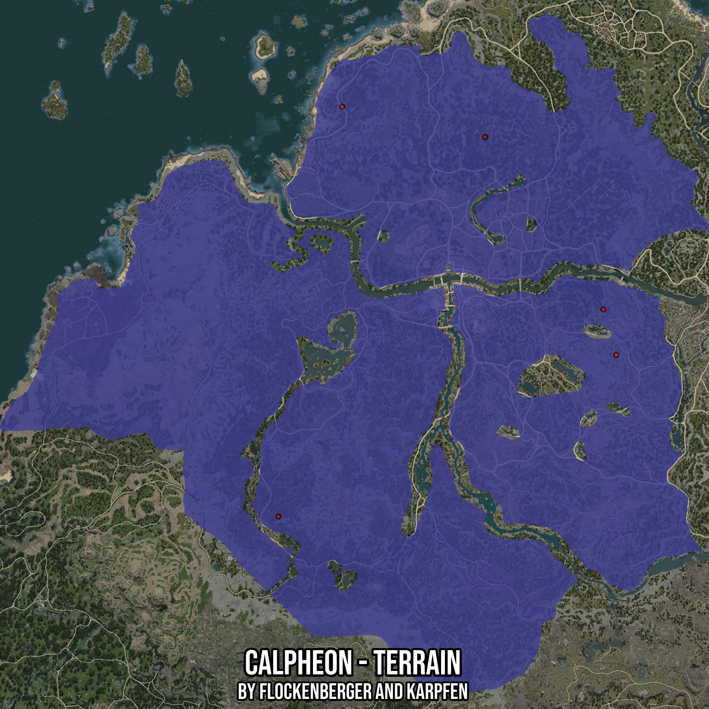

# Calpheon - Terrain
Created by **flockenberger**

- **Red Points**: Exact in-game waypoints.
- **Colored Areas**: Entire area where the fishing table is consistent.
## ⚠️ Info about your float:
To verify your fishing position without modifying your files, you can do so [here](https://flockenberger.github.io/bdo-fish-position/).
- Or watch the guide [here](https://youtu.be/t-VXcRoNojk)

## Waypoints
Below you'll find the Copy-Paste ready XML file for this Fishing-Zone.

```xml
	<!--
		Waypoints for: Calpheon - Terrain
		Auto-Generated by: flockenberger
		Preview at: https://github.com/Flockenberger/bdo-fish-waypoints/tree/main/Bookmark/Calpheon%20-%20Terrain
	-->
	<WorldmapBookMark>
		<BookMark BookMarkName="1: Calpheon - Terrain" PosX="-372856.4378261566" PosY="0.0" PosZ="-215040.04426002502" />
		<BookMark BookMarkName="2: Calpheon - Terrain" PosX="-328583.49578380585" PosY="0.0" PosZ="69270.54953575134" />
		<BookMark BookMarkName="3: Calpheon - Terrain" PosX="-138541.13912582397" PosY="0.0" PosZ="-103002.3950099945" />
		<BookMark BookMarkName="4: Calpheon - Terrain" PosX="-147576.43342018127" PosY="0.0" PosZ="-71378.86497974396" />
		<BookMark BookMarkName="5: Calpheon - Terrain" PosX="-229496.43502235413" PosY="0.0" PosZ="48188.19618225098" />
	</WorldmapBookMark>
```

## Usage Guide
[](https://youtu.be/W-bWmKdv8K8)

## Previews
     

 