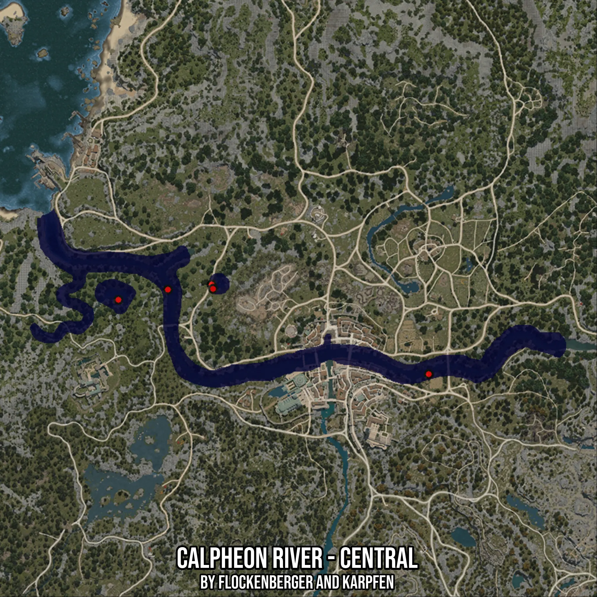

# Calpheon River - Central
Created by **flockenberger**

- **Red Points**: Exact in-game waypoints.
- **Colored Areas**: Entire area where the fishing table is consistent.
## ⚠️ Info about your float:
To verify your fishing position without modifying your files, you can do so [here](https://flockenberger.github.io/bdo-fish-position/).
- Or watch the guide [here](https://youtu.be/t-VXcRoNojk)

## Waypoints
Below you'll find the Copy-Paste ready XML file for this Fishing-Zone.

```xml
	<!--
		Waypoints for: Calpheon River - Central
		Auto-Generated by: flockenberger
		Preview at: https://github.com/Flockenberger/bdo-fish-waypoints/tree/main/Bookmark/Calpheon%20River%20-%20Central
	-->
	<WorldmapBookMark>
		<BookMark BookMarkName="1: Calpheon River - Central" PosX="-213232.905292511" PosY="0.0" PosZ="-58127.100014686584" />
		<BookMark BookMarkName="2: Calpheon River - Central" PosX="-341534.08427238464" PosY="0.0" PosZ="-27407.099413871765" />
		<BookMark BookMarkName="3: Calpheon River - Central" PosX="-302983.49528312683" PosY="0.0" PosZ="-21082.393407821655" />
		<BookMark BookMarkName="4: Calpheon River - Central" PosX="-321054.08387184143" PosY="0.0" PosZ="-23190.628743171692" />
		<BookMark BookMarkName="5: Calpheon River - Central" PosX="-302381.1423301697" PosY="0.0" PosZ="-22889.452266693115" />
	</WorldmapBookMark>
```

## Usage Guide
[](https://youtu.be/W-bWmKdv8K8)

## Previews
     

 