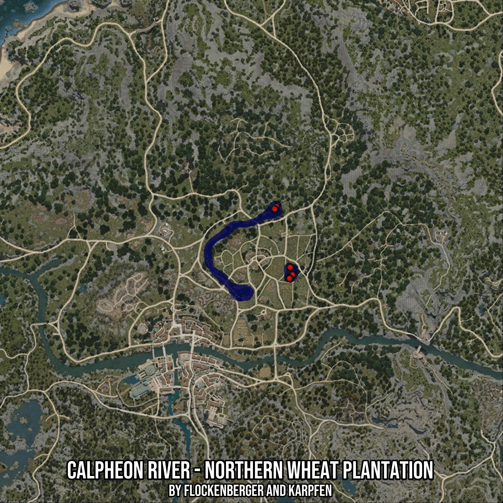

# Calpheon River - Northern Wheat Plantation
Created by **flockenberger**

- **Red Points**: Exact in-game waypoints.
- **Colored Areas**: Entire area where the fishing table is consistent.
## ⚠️ Info about your float:
To verify your fishing position without modifying your files, you can do so [here](https://flockenberger.github.io/bdo-fish-position/).
- Or watch the guide [here](https://youtu.be/t-VXcRoNojk)

## Waypoints
Below you'll find the Copy-Paste ready XML file for this Fishing-Zone.

```xml
	<!--
		Waypoints for: Calpheon River - Northern Wheat Plantation
		Auto-Generated by: flockenberger
		Preview at: https://github.com/Flockenberger/bdo-fish-waypoints/tree/main/Bookmark/Calpheon%20River%20-%20Northern%20Wheat%20Plantation
	-->
	<WorldmapBookMark>
		<BookMark BookMarkName="1: Calpheon River - Northern Wheat Plantation" PosX="-204498.78747463226" PosY="0.0" PosZ="19576.430916786194" />
		<BookMark BookMarkName="2: Calpheon River - Northern Wheat Plantation" PosX="-196668.19908618927" PosY="0.0" PosZ="-13854.157972335815" />
		<BookMark BookMarkName="3: Calpheon River - Northern Wheat Plantation" PosX="-198174.08146858215" PosY="0.0" PosZ="-15661.216831207275" />
		<BookMark BookMarkName="4: Calpheon River - Northern Wheat Plantation" PosX="-197872.90499210358" PosY="0.0" PosZ="-10240.040254592896" />
		<BookMark BookMarkName="5: Calpheon River - Northern Wheat Plantation" PosX="-205402.316904068" PosY="0.0" PosZ="18371.725010871887" />
	</WorldmapBookMark>
```

## Usage Guide
[](https://youtu.be/W-bWmKdv8K8)

## Previews
     

 