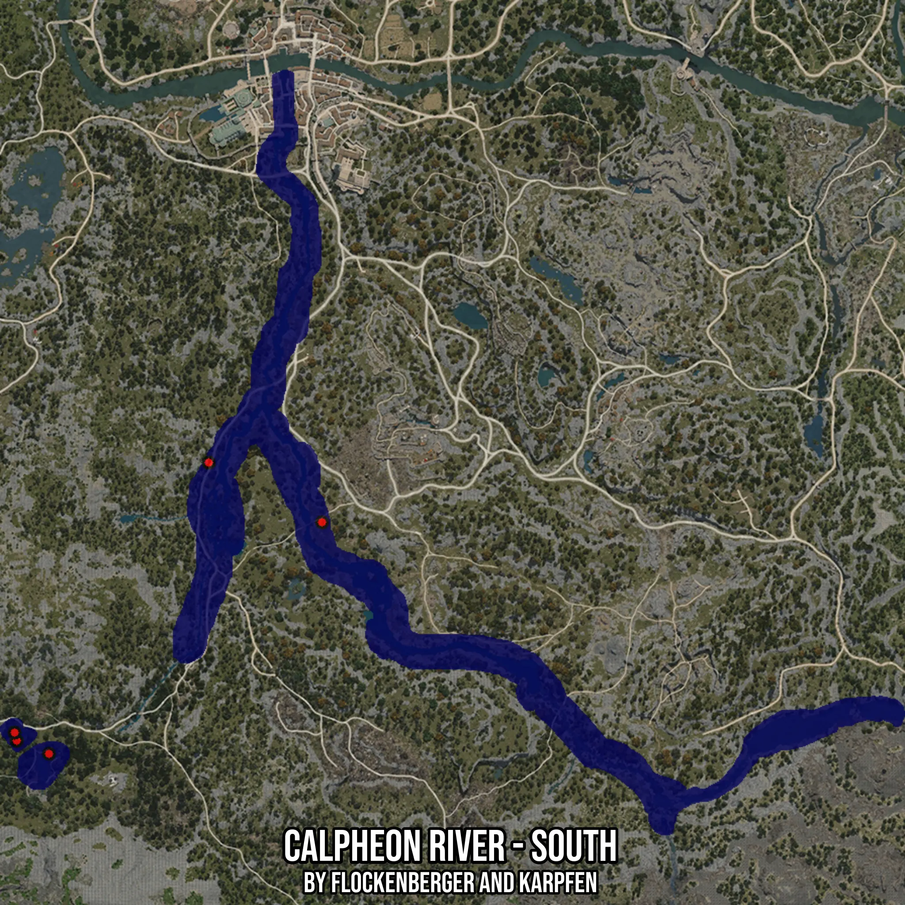

# Calpheon River - South
Created by **flockenberger**

- **Red Points**: Exact in-game waypoints.
- **Colored Areas**: Entire area where the fishing table is consistent.
## ⚠️ Info about your float:
To verify your fishing position without modifying your files, you can do so [here](https://flockenberger.github.io/bdo-fish-position/).
- Or watch the guide [here](https://youtu.be/t-VXcRoNojk)

## Waypoints
Below you'll find the Copy-Paste ready XML file for this Fishing-Zone.

```xml
	<!--
		Waypoints for: Calpheon River - South
		Auto-Generated by: flockenberger
		Preview at: https://github.com/Flockenberger/bdo-fish-waypoints/tree/main/Bookmark/Calpheon%20River%20-%20South
	-->
	<WorldmapBookMark>
		<BookMark BookMarkName="1: Calpheon River - South" PosX="-243049.37646389008" PosY="0.0" PosZ="-187030.6319475174" />
		<BookMark BookMarkName="2: Calpheon River - South" PosX="-324367.0251131058" PosY="0.0" PosZ="-256000.04506111145" />
		<BookMark BookMarkName="3: Calpheon River - South" PosX="-334004.6723604202" PosY="0.0" PosZ="-252084.75086688995" />
		<BookMark BookMarkName="4: Calpheon River - South" PosX="-334607.0253133774" PosY="0.0" PosZ="-249675.33905506134" />
		<BookMark BookMarkName="5: Calpheon River - South" PosX="-276781.14182949066" PosY="0.0" PosZ="-169261.21983528137" />
	</WorldmapBookMark>
```

## Usage Guide
[](https://youtu.be/W-bWmKdv8K8)

## Previews
     

 