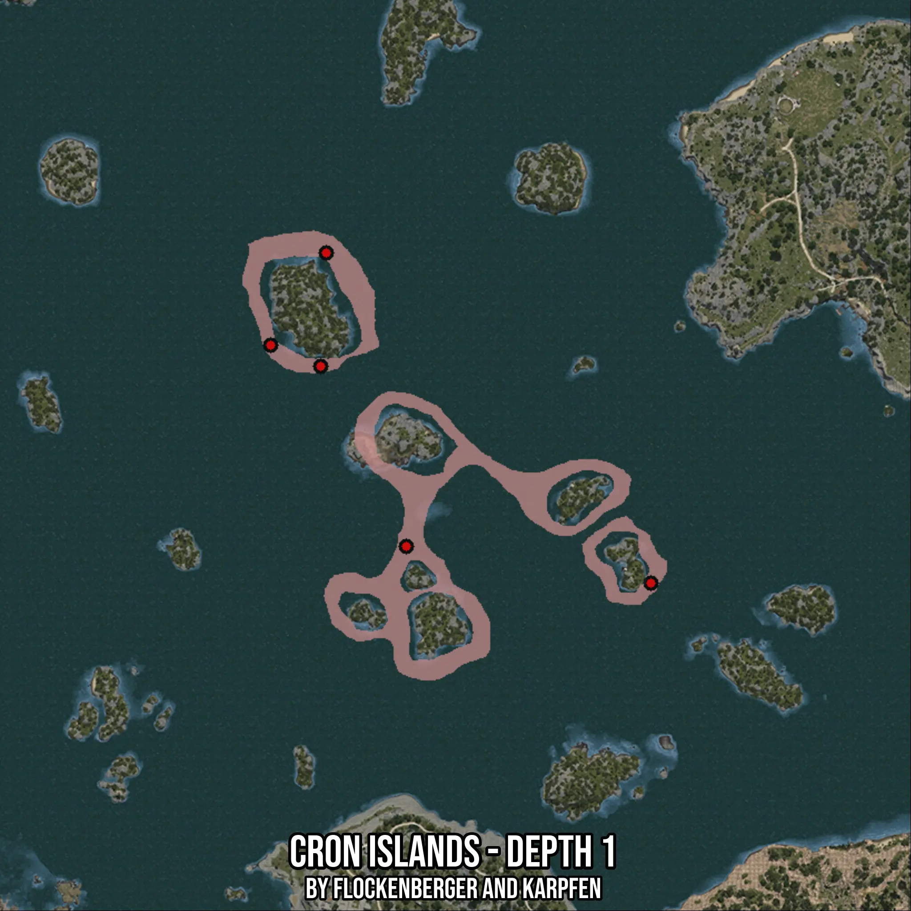

# Cron Islands - Depth 1
Created by **flockenberger**

- **Red Points**: Exact in-game waypoints.
- **Colored Areas**: Entire area where the fishing table is consistent.
## ⚠️ Info about your float:
To verify your fishing position without modifying your files, you can do so [here](https://flockenberger.github.io/bdo-fish-position/).
- Or watch the guide [here](https://youtu.be/t-VXcRoNojk)

## Waypoints
Below you'll find the Copy-Paste ready XML file for this Fishing-Zone.

```xml
	<!--
		Waypoints for: Cron Islands - Depth 1
		Auto-Generated by: flockenberger
		Preview at: https://github.com/Flockenberger/bdo-fish-waypoints/tree/main/Bookmark/Cron%20Islands%20-%20Depth%201
	-->
	<WorldmapBookMark>
		<BookMark BookMarkName="1: Cron Islands - Depth 1" PosX="35237.68780231476" PosY="-8175.0" PosZ="227087.0232105255" />
		<BookMark BookMarkName="2: Cron Islands - Depth 1" PosX="13552.981495857239" PosY="-8175.0" PosZ="306597.61300086975" />
		<BookMark BookMarkName="3: Cron Islands - Depth 1" PosX="101496.51262760162" PosY="-8175.0" PosZ="217148.19948673248" />
		<BookMark BookMarkName="4: Cron Islands - Depth 1" PosX="-1505.8423280715942" PosY="-8175.0" PosZ="281599.9654531479" />
		<BookMark BookMarkName="5: Cron Islands - Depth 1" PosX="12047.099113464355" PosY="-8175.0" PosZ="275877.61240005493" />
	</WorldmapBookMark>
```

## Usage Guide
[](https://youtu.be/W-bWmKdv8K8)

## Previews
     

 