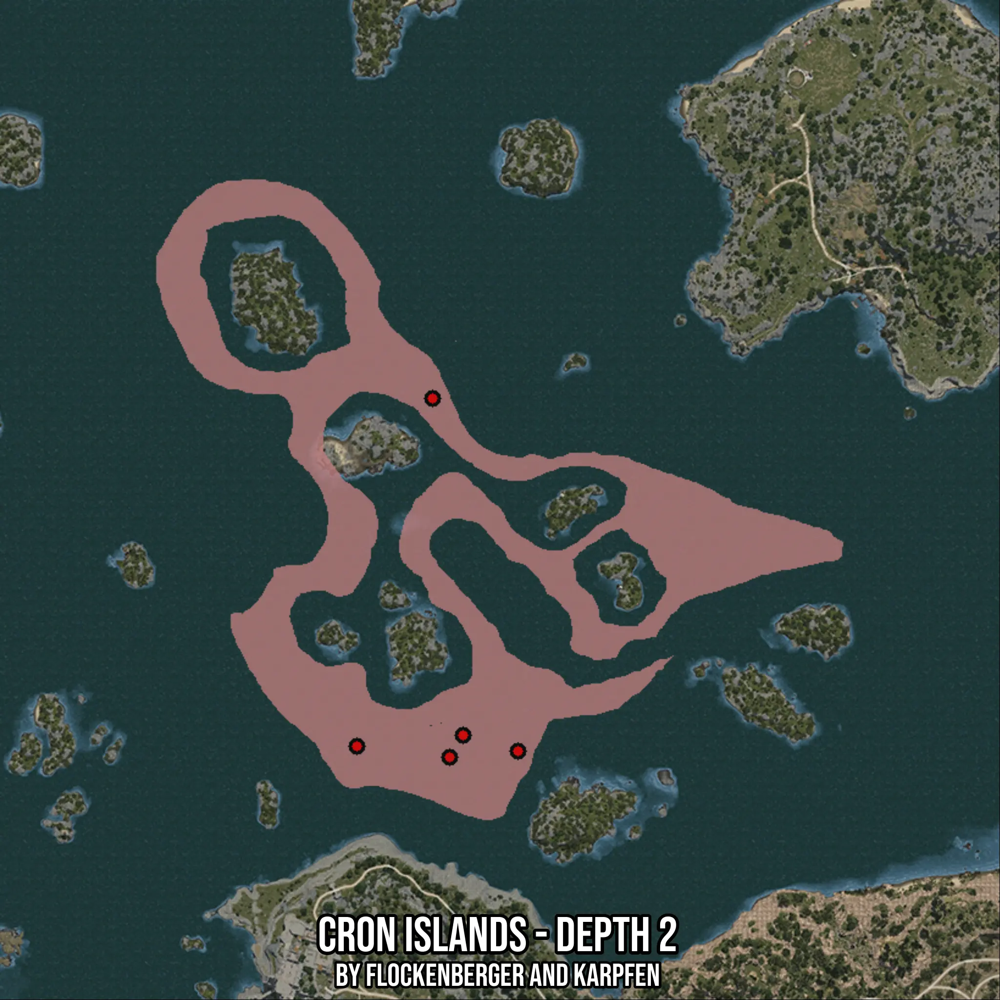

# Cron Islands - Depth 2
Created by **flockenberger**

- **Red Points**: Exact in-game waypoints.
- **Colored Areas**: Entire area where the fishing table is consistent.
## ⚠️ Info about your float:
To verify your fishing position without modifying your files, you can do so [here](https://flockenberger.github.io/bdo-fish-position/).
- Or watch the guide [here](https://youtu.be/t-VXcRoNojk)

## Waypoints
Below you'll find the Copy-Paste ready XML file for this Fishing-Zone.

```xml
	<!--
		Waypoints for: Cron Islands - Depth 2
		Auto-Generated by: flockenberger
		Preview at: https://github.com/Flockenberger/bdo-fish-waypoints/tree/main/Bookmark/Cron%20Islands%20-%20Depth%202
	-->
	<WorldmapBookMark>
		<BookMark BookMarkName="1: Cron Islands - Depth 2" PosX="55717.68820285797" PosY="-8175.0" PosZ="184319.96355056763" />
		<BookMark BookMarkName="2: Cron Islands - Depth 2" PosX="29515.3347492218" PosY="-8175.0" PosZ="181609.37526226044" />
		<BookMark BookMarkName="3: Cron Islands - Depth 2" PosX="52404.74696159363" PosY="-8175.0" PosZ="178898.78697395325" />
		<BookMark BookMarkName="4: Cron Islands - Depth 2" PosX="48188.276290893555" PosY="-8175.0" PosZ="267444.6710586548" />
		<BookMark BookMarkName="5: Cron Islands - Depth 2" PosX="69270.62964439392" PosY="-8175.0" PosZ="180404.66935634613" />
	</WorldmapBookMark>
```

## Usage Guide
[](https://youtu.be/W-bWmKdv8K8)

## Previews
     

 