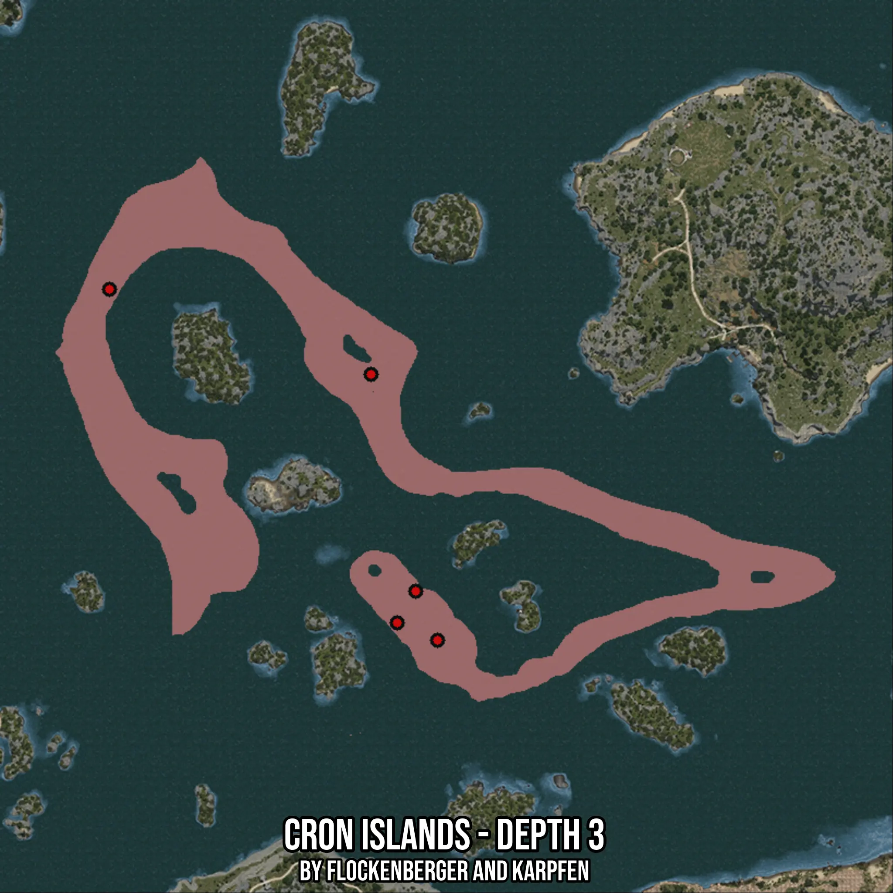

# Cron Islands - Depth 3
Created by **flockenberger**

- **Red Points**: Exact in-game waypoints.
- **Colored Areas**: Entire area where the fishing table is consistent.
## ⚠️ Info about your float:
To verify your fishing position without modifying your files, you can do so [here](https://flockenberger.github.io/bdo-fish-position/).
- Or watch the guide [here](https://youtu.be/t-VXcRoNojk)

## Waypoints
Below you'll find the Copy-Paste ready XML file for this Fishing-Zone.

```xml
	<!--
		Waypoints for: Cron Islands - Depth 3
		Auto-Generated by: flockenberger
		Preview at: https://github.com/Flockenberger/bdo-fish-waypoints/tree/main/Bookmark/Cron%20Islands%20-%20Depth%203
	-->
	<WorldmapBookMark>
		<BookMark BookMarkName="1: Cron Islands - Depth 3" PosX="-18974.07796382904" PosY="-8175.0" PosZ="309910.5542421341" />
		<BookMark BookMarkName="2: Cron Islands - Depth 3" PosX="65656.511926651" PosY="-8175.0" PosZ="226484.67025756836" />
		<BookMark BookMarkName="3: Cron Islands - Depth 3" PosX="60536.5118265152" PosY="-8175.0" PosZ="217750.55243968964" />
		<BookMark BookMarkName="4: Cron Islands - Depth 3" PosX="53308.27639102936" PosY="-8175.0" PosZ="286418.7890768051" />
		<BookMark BookMarkName="5: Cron Islands - Depth 3" PosX="71680.04145622253" PosY="-8175.0" PosZ="212931.7288160324" />
	</WorldmapBookMark>
```

## Usage Guide
[](https://youtu.be/W-bWmKdv8K8)

## Previews
     

 