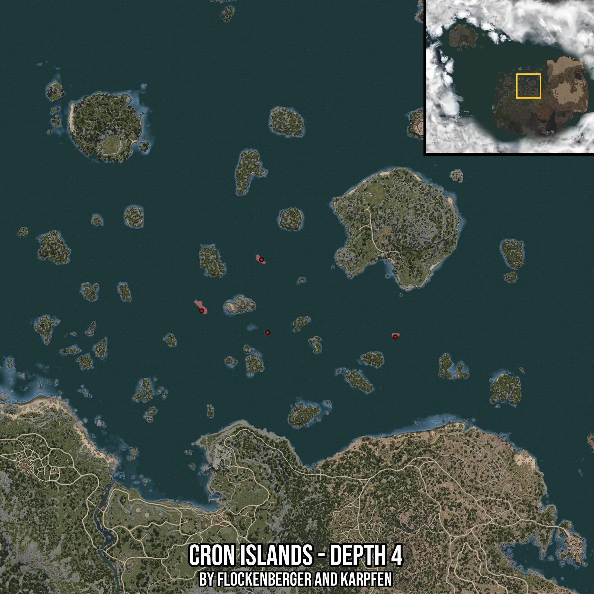

# Cron Islands - Depth 4
Created by **flockenberger**

- **Red Points**: Exact in-game waypoints.
- **Colored Areas**: Entire area where the fishing table is consistent.
## ⚠️ Info about your float:
To verify your fishing position without modifying your files, you can do so [here](https://flockenberger.github.io/bdo-fish-position/).
- Or watch the guide [here](https://youtu.be/t-VXcRoNojk)

## Waypoints
Below you'll find the Copy-Paste ready XML file for this Fishing-Zone.

```xml
	<!--
		Waypoints for: Cron Islands - Depth 4
		Auto-Generated by: flockenberger
		Preview at: https://github.com/Flockenberger/bdo-fish-waypoints/tree/main/Bookmark/Cron%20Islands%20-%20Depth%204
	-->
	<WorldmapBookMark>
		<BookMark BookMarkName="1: Cron Islands - Depth 4" PosX="0.0400543212890625" PosY="-8175.0" PosZ="253891.72961711884" />
		<BookMark BookMarkName="2: Cron Islands - Depth 4" PosX="46983.57038497925" PosY="-8175.0" PosZ="295454.0833711624" />
		<BookMark BookMarkName="3: Cron Islands - Depth 4" PosX="162032.98439979553" PosY="-8175.0" PosZ="230399.96445178986" />
		<BookMark BookMarkName="4: Cron Islands - Depth 4" PosX="54211.80582046509" PosY="-8175.0" PosZ="231905.84683418274" />
		<BookMark BookMarkName="5: Cron Islands - Depth 4" PosX="161731.80792331696" PosY="-8175.0" PosZ="230399.96445178986" />
	</WorldmapBookMark>
```

## Usage Guide
[](https://youtu.be/W-bWmKdv8K8)

## Previews
     

 