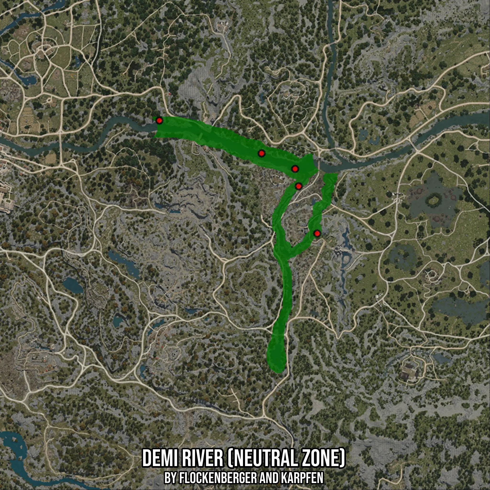

# Demi River (Neutral Zone)
Created by **flockenberger**

- **Red Points**: Exact in-game waypoints.
- **Colored Areas**: Entire area where the fishing table is consistent.
## ⚠️ Info about your float:
To verify your fishing position without modifying your files, you can do so [here](https://flockenberger.github.io/bdo-fish-position/).
- Or watch the guide [here](https://youtu.be/t-VXcRoNojk)

## Waypoints
Below you'll find the Copy-Paste ready XML file for this Fishing-Zone.

```xml
	<!--
		Waypoints for: Demi River (Neutral Zone)
		Auto-Generated by: flockenberger
		Preview at: https://github.com/Flockenberger/bdo-fish-waypoints/tree/main/Bookmark/Demi%20River%20(Neutral%20Zone)
	-->
	<WorldmapBookMark>
		<BookMark BookMarkName="1: Demi River (Neutral Zone)" PosX="-87039.96164798737" PosY="0.0" PosZ="-66861.21783256531" />
		<BookMark BookMarkName="2: Demi River (Neutral Zone)" PosX="-103905.84433078766" PosY="0.0" PosZ="-59030.629444122314" />
		<BookMark BookMarkName="3: Demi River (Neutral Zone)" PosX="-85232.9027891159" PosY="0.0" PosZ="-75595.33565044403" />
		<BookMark BookMarkName="4: Demi River (Neutral Zone)" PosX="-155407.02180862427" PosY="0.0" PosZ="-42465.9232378006" />
		<BookMark BookMarkName="5: Demi River (Neutral Zone)" PosX="-75896.43201828003" PosY="0.0" PosZ="-99388.27729225159" />
	</WorldmapBookMark>
```

## Usage Guide
[](https://youtu.be/W-bWmKdv8K8)

## Previews
     

 